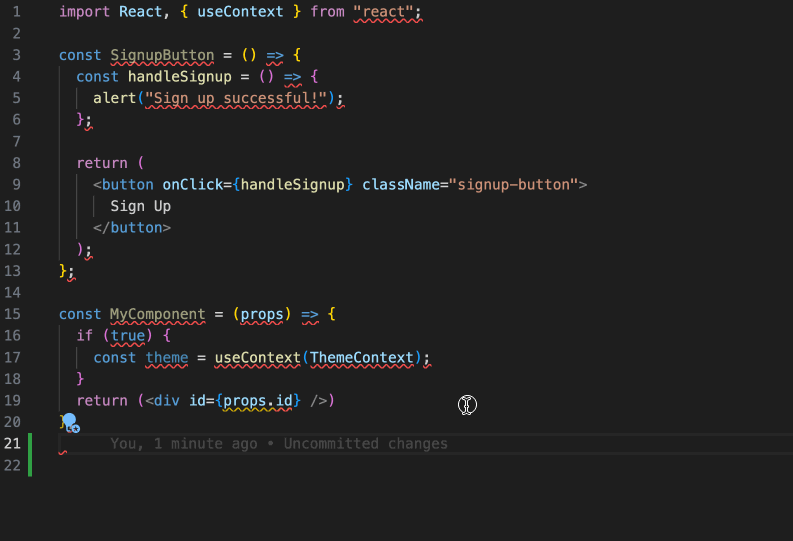

# Dev Containers - Why You Need Them

Blog on [DEV.to](https://dev.to/graezykev/series/27802)

Welcome to the Dev Container series:

- [Part 0: Dev Containers - Why You Need Them](./README.md)
- [Part 1: Quick Start - Basic Setup and Usage](./part-1.md)
- [Part 2: Image, Features, Workspace, Environment Variables](./part-2.md)
- [Part 3: Full Stack Dev - Docker Compose & Database](./part-3.md)
- [Part 4: Remote Dev - Develop on a Remote Docker Host](./part-4.md)
- [Part 5: Multiple Projects & Shared Container Configuration](./part-5.md)

## It Works on My Machine

Picture this: You're a newbie developer, excited to dive into your first big project. You clone the repository, open your terminal, and confidently type in the command to start the project. But instead of seeing the application running smoothly, you're greeted with a wall of error messages.

Frustrated, you turn to your mentor for help.

- **You**: Hi mentor, I can't start this project! I'm encountering too many errors!
- **Mentor**: Hmm, it works on my machine. Let me check. Oh, I see, I'm using `Node.js` v14. What about you?
- **You**: I'm on v18.
- **Mentor**: That explains it. Switch back to v14. It's easy, just run `nvm use 14`.
- **You**: Sorry, what's NVM?

You realise that just one small version difference can cause big headaches, and you're left wondering how to manage these differences seamlessly.

## Managing Software and Versions

Our team has several full-stack JavaScript projects, some relying on different versions of `Node.js`. Upgrading them all at once isn't feasible (it's annoying but common in real-world scenarios).

Whenever a new member joins, they must install `NVM` and multiple versions of `Node.js` in order to run those projects.

## VS Code Extensions

VS Code extensions can significantly boost development efficiency.

For instance, many JavaScript developers use [`ESLint`](https://marketplace.visualstudio.com/items?itemName=dbaeumer.vscode-eslint) and [`Prettier`](https://marketplace.visualstudio.com/items?itemName=esbenp.prettier-vscode) extensions to auto-format code and fix conventions with a simple `Command + S` (`Control + S`):

As an experienced developer, you likely have other VS Code extensions to recommend to your team. However, getting them to install each one, and possibly specific versions of the extensions, can be challenging.

## Editor Settings

Every team follows its own code conventions, such as using 2 or 4 **spaces** for indentation or preferring **tabs**.

To reduce the hassle for your team, consider how difficult it would be if your new colleague's editor auto-inserts 4 spaces instead of the team's "2 spaces" convention when hitting `Tab`.

## Setting up a Working Environment is Painful

New team members often spend over two days installing and configuring necessary tools.

Network issues, firewalls, dependency, and dependencies of a dependency can be a nightmare, especially in some scenarios they need to run Unix-like commands on a Windows PC.

## Easier and Faster Onboarding

All these problems can be resolved with Dev Containers.

Here's how a newcomer can quickly integrate into the development team:

1. Use any preferred machine or system (Mac, Windows, Ubuntu).
2. Install Docker (without needing to understand it), which is straightforward.
3. Install VS Code (just 2 to 3 clicks).
4. Download or clone the project.
5. Open the project in VS Code, follow the prompt to build a Dev Container, and start developing!

## Emergency Situations

Imagine this: It's a sunny Saturday, and you're finally enjoying a much-needed day off. You're at the park with your family, soaking in the sun, when suddenly, your phone rings. It's your manager, and she sounds frantic.

- **Manager**: We've got a huge problem! The code you pushed yesterday is causing memory leaks, and users are flooding us with complaints. We need a fix immediately!
- **You**: I understand, but I'm not at home. I don't have my laptop with me.
- **Manager**: This issue requires an urgent fix. Can you handle it?

Panic sets in. Fixing this issue requires just a tiny change, but how can you possibly manage it without your usual setup?

With Dev Containers, you could calmly say:

- **You**: No problem. I can handle it right here.

You pull out your wife's iPad, connect to the internet, and open VS Code in the browser. Thanks to Dev Containers, you have an exact replica of your development environment, complete with all necessary tools and settings. Within minutes, you've made the fix and pushed the changes, all from a device you never thought you could code on.

## What is a Dev Container?

What exactly is a Dev Container, and how does it work?

If you're familiar with backend development or containers like Docker, Dev Containers will seem familiar.

Even if you're new to containers, using Dev Containers in VS Code is simple and doesn't require in-depth knowledge of containers or Docker (though you need to install Docker).

A Dev Container runs a Docker container with all development software, configurations, VS Code extensions, and settings, sharing environments with the local OS via VS Code.

This creates reproducible development environments usable on any PC, anytime, anywhere.

Dev Containers offer:

- Pre-installed and pre-configured systems and software:
  - Latest stable LTS `Ubuntu`
  - Tools like `Git`, `wget`, `curl`
  - `NVM` and multiple versions of `Node.js`
  - Package managers like `PNPM`, `YARN`
  - Programming languages like `Python`, `Ruby`, `Go`, `Java`, `Rust`
  - Databases like `PostgreSQL` and extensions
  - Customised shells (e.g., `Zsh` with themes from [Oh My Zsh](https://github.com/ohmyzsh/ohmyzsh/wiki/Themes))
  - Other customised software or settings

- Pre-installed VS Code extensions:
  - Specific extensions and versions (including pre-releases)
  - Self-made extensions

- Pre-configured VS Code settings:
  - Tab size: 2
  - Auto-insert spaces on hitting `Tab`: true
  - Font size and family
  - And more...

- Automatic workflow scripts:
  - Automatically run `npm install` or `npm start` or other scripts as needed

- Develop remotely without a PC!

- And more...

## Steps to Use Dev Containers

I have several guides on setting up and using Dev Containers, each brief and easy to follow:

- Dev Containers - Why You Need Them
- [Part 1: Quick Start - Basic Setup and Usage](./part-1.md)
- [Part 2: Image, Features, Workspace, Environment Variables](./part-2.md)
- [Part 3: Full Stack Dev - Docker Compose & Database](./part-3.md)
- [Part 4: Remote Dev - Develop on a Remote Docker Host](./part-4.md)
- [Part 5: Multiple Projects & Shared Container Configuration](./part-5.md)
