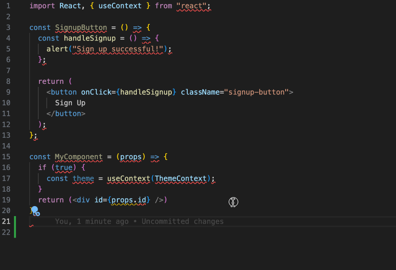

# Dev Container - Why I Need It

## It Works on My Machine

Look at this conversation between a newbie developer and his mentor:

- Hi, mentor, I can't start this project! Just ran into too many errors!
- It works on my machine! Oops! I'm using `Node.js` v14, what about you?
- v18.
- Switch it back to v14, it's easy, just run `nvm use 14`.
- Sorry what's NVM?
- ...

## Software and Software Versions Management

My team has several full-stack JavaScript projects, some are historical projects relying on different versions of `Node.js`, and we're not able to upgrade them in time (it's annoying but it's common in real scenarios).

Now every time a new member comes, we need this newbie to install `NVM`, as well as multiple versions of `Node.js` on top of that.

## VS Code Extensions

VS Code extensions can sometimes crucially improve our development efficiency and speed.

I saw so many JavaScript developers using ESLint and Prettier extensions to auto-format their code and auto-fix some code convention problems with just hitting `Command + s` (`Control + s`):

As an experienced developer, you must have lots of other extensions want to recommend to your teammates, but asking them to install them one by one is not an easy thing, let alone in some cases you may ask them to install a specific version of an extension ...

## Editor Setting

Every team has its own code convention, some use 2 spaces as indention, some use 4 spaces, while others may prefer a real "tab".

Whatever convention you're using, a team leader needs to reduce your teammates's pain to follow it, what if you're using the "2 spaces" convention, but your new colleague's editor auto inserts 4 spaces when he hits the `Tab` key ...

## Emergency Situation

You're on a day off today, your manager just rang you up because you made a huge mistake on the code published yesterday leading to memory leaks and users are complaining! This issue requires just a tiny change in the code to fix but you don't have your laptop right now, all you have is your wife's iPad!

## Setting up a Working Environment is Painful

There are lots of software or tools a new member needs to install and configure when he/she joins, this may even take more than 2 days.

Think about those network issues, firewall issues, dependencies, and dependencies of dependency etc., which can be a nightmare to a newcomer.

What's worse, you may ask this newcomer to start your project by running Unix-like commands, but he is using a Windows PC.

## Easier and Faster Onboarding

All the problems above can be solved by using Dev Containers.

Here is what a newcomer needs to do to involve himself/herself with the development team as fast as possible and as easy as possible:

- 1. Pick whatever machine or system he/she likes, Mac, Windows, Ubuntu, don't matter!

- 2. Install Docker on the machine (without asking what Docker is), which is super easy.

- 3. Install VS Code, just 2 to 3 clicks?

- 4. Download/Clone the project.

- 5. Open the project in VS Code, follow the prompt to build a Dev Container, and enjoy the development!

## What is Dev Container

So what on earth is Dev Container? How does it work under the hood?

If you are a backend developer, or you have experience with containers like Docker, Dev Containers is nothing new to you!

Even if you never used containers before, you don't need to dive deep into the concepts because using Dev Containers in VS Code is very simple with no requirement of understanding what Docker is.

Create reproducible development environments, to use on any PC, anytime, anywhere.

By running a Docker container which has all development software and configurations.

- Pre-install, Pre-configure:
  - Operating system (the latest stable LTS Ubuntu)
  - Git
  - Node.js and its multiple versions
    - Because our historical projects rely on different Node.js version
  - PNPM, YARN
  - Python, Ruby, Go, Java, ...
  - Databases such as PostgreSQL and its extensions
  - Customised Shell
    - Set Zsh as the default shell
    - Shell prompt or themes <https://github.com/ohmyzsh/ohmyzsh/wiki/Themes>
  - Other customised software or settings
- Pre-install VS Code extensions
  - specific extensions
  - specific versions (pre-release version)
  - self-made extensions
- Pre-configure VS Code
  - tabSize: 2
  - insertSpaces: true
  - detectIndentation: false
  - fontSize
  - fontFamily
  - auto run `npm install` or other initial scripts

## Steps for Dev Containers

I have several guides on how to set up and use Dev Container, check them out one by one!

- [Part 1: Basic Setups and Usage](./part-1.md)
- [Part 2: Image, Features, Workspace, Environment Variables](./part-2.md)
- [Part 3: Full Stack Dev - Docker Compose & Database](./part-3.md)
- [Part 4: Remote Dev - Develop on a Remote Docker Host](./part-4.md)
- [Part 5: Multiple Projects & Shared Container Configure](./part-5.md)

## Appendix: Related Docs

- [Dev Containers tutorial](https://code.visualstudio.com/docs/devcontainers/tutorial)
  - How it works

- [Create a Dev Container](https://code.visualstudio.com/docs/devcontainers/create-dev-container)
  - Create a devcontainer.json file
    - Dockerfile
    - Use an image as a starting point
  - Install additional software
  - Use Docker Compose
  - [Mount & Add another local file mount](https://code.visualstudio.com/remote/advancedcontainers/add-local-file-mount)
  - [Environment variables](https://code.visualstudio.com/remote/advancedcontainers/environment-variables)

- Remote development
  - [Remote development over SSH](https://code.visualstudio.com/docs/remote/ssh-tutorial)
  - [Developing with Remote Tunnels](https://code.visualstudio.com/docs/remote/tunnels)

- [Connect to multiple containers](https://code.visualstudio.com/remote/advancedcontainers/connect-multiple-containers)
