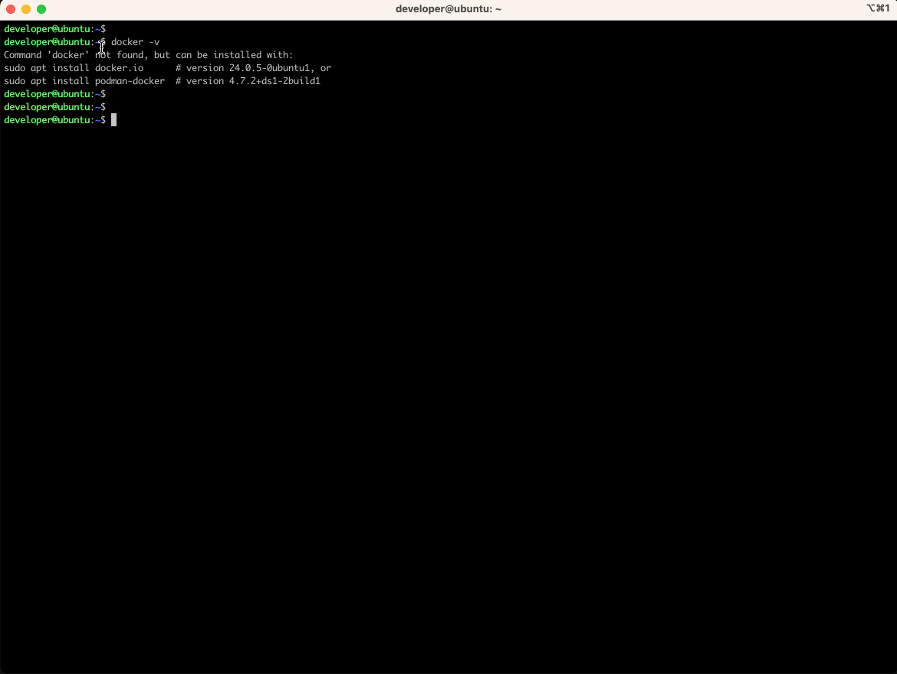
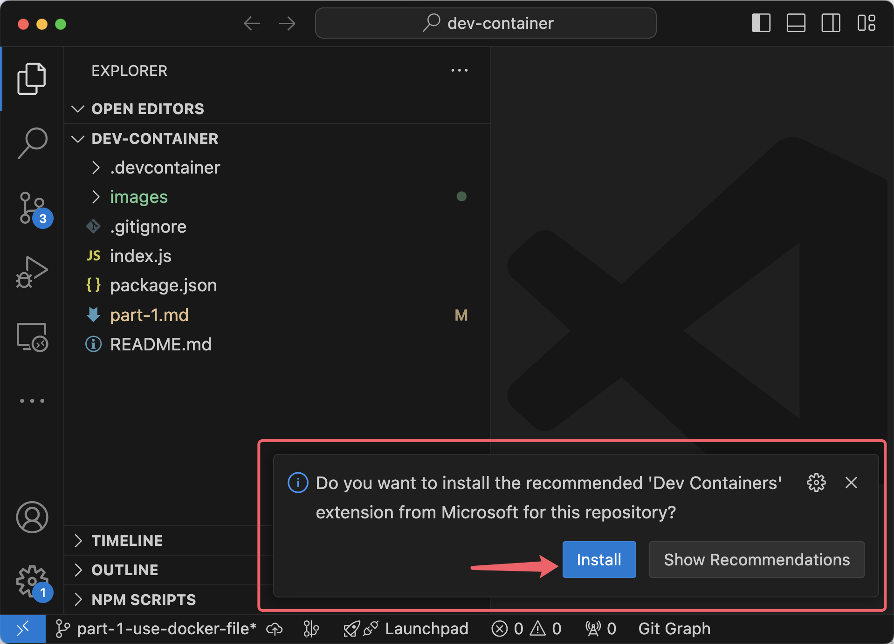
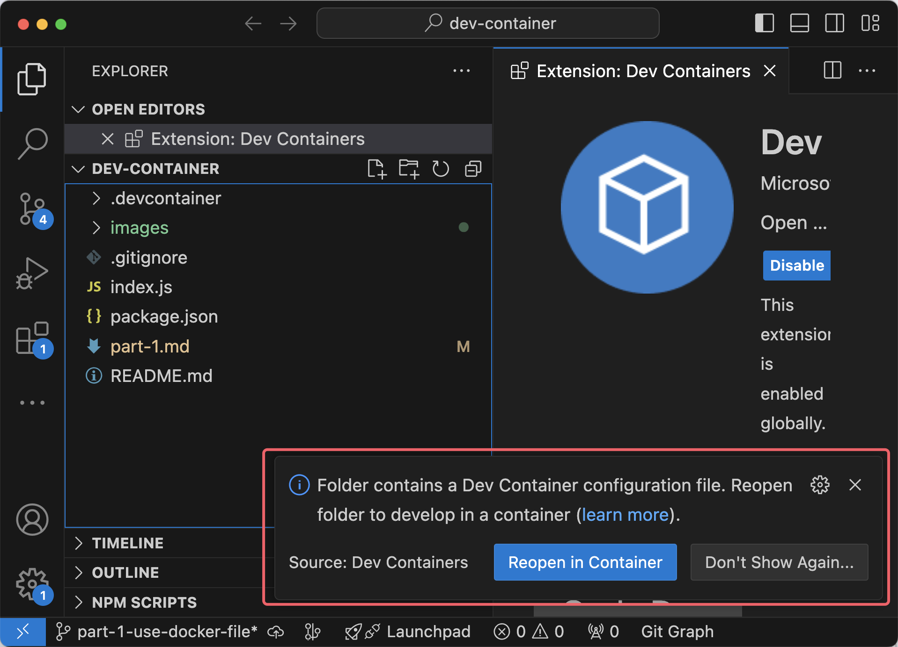
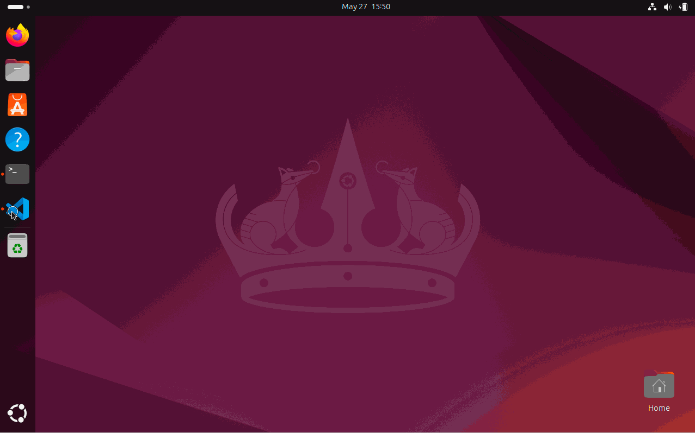

# Part 1: Basic Setups and Usage

I wrote about the [reason why I want to use Dev Containers](./README.md) in my last post.

In this guide, Let's imagine we have a `Node.js` project, I want anyone who want to develop this project without manually install `Node.js`.

I have some "must use" VS Code extensions when they developing this project, and when they are involved in this project, there are no need for them to proofread every extension's name and intall them manually.

What's more, as we have some coding conventions everyone need to stick to, like using 2 spaces to indent our code (instead of a `Tab` or 4 spaces etc.), I want my teammates to achieve this even without knowing the conventions.

## 1. Install VS Code

[JetBrains WebStorm](https://www.jetbrains.com/help/webstorm/connect-to-devcontainer.html) also support Dev Containers, but I haven't tried before, in my posts I primary focus on VS Code.

## 2. Install **Docker**

Installing Docker is quit easy and fast, I suggest you follow the [officail guide](https://docs.docker.com/engine/install/).

If you are using Windows or Mac system, it's super straightforward with a few clicks to install.

Even you're using Linux, it's also very easy within a few Linux comnands.

- Windows PC: Install **Docker Desktop** within a few clicks <https://docs.docker.com/desktop/install/windows-install/>.
- Mac: Install **Docker Desktop** within a few clicks <https://docs.docker.com/desktop/install/mac-install/>.
- Linux PC: Install **Docker Engine** within a few Linux comnands <https://docs.docker.com/engine/install/ubuntu/>.

For example, I'm using a Ubuntu Linux, I install Docker Engine by the following commands according to [this guide](https://docs.docker.com/engine/install/ubuntu/), and I have a full record of the installation below.

```sh
# Add Docker's official GPG key:
sudo apt-get update
sudo apt-get install ca-certificates curl
sudo install -m 0755 -d /etc/apt/keyrings
sudo curl -fsSL https://download.docker.com/linux/ubuntu/gpg -o /etc/apt/keyrings/docker.asc
sudo chmod a+r /etc/apt/keyrings/docker.asc

# Add the repository to Apt sources:
echo \
  "deb [arch=$(dpkg --print-architecture) signed-by=/etc/apt/keyrings/docker.asc] https://download.docker.com/linux/ubuntu \
  $(. /etc/os-release && echo "$VERSION_CODENAME") stable" | \
  sudo tee /etc/apt/sources.list.d/docker.list > /dev/null
sudo apt-get update
```

```sh
sudo apt-get install docker-ce docker-ce-cli containerd.io docker-buildx-plugin docker-compose-plugin
```

```sh
sudo usermod -aG docker $USER # replace $USER with your Linux login user name
```

```sh
sudo reboot # restart the system
```

```sh
docker -v # varify the installation
```



## 3. Project Setup

If you're looking to have a quick glance, you can just clone my demo project here <https://github.com/graezykev/dev-container/tree/part-1-use-docker-file> and go to the next step.

```sh
git clone -b part-1-use-docker-file https://github.com/graezykev/dev-container.git part-1-use-docker-file
```

My Dev Container might be kind of hefty and take relatively long time to buid, if you prefer to write a more simple demo, here's how I setup a super simple demo:

- Initiate a project.
- Create a `.devcontainer` folder.
- Create a file name `devcontainer.json`.
- Create a file name `Dockerfile`.
- Create a simple Node.js program.

```sh
mkdir your-project-folder && \
cd your-project-folder && \
mkdir .devcontainer && \
touch .devcontainer/devcontainer.json && \
touch .devcontainer/Dockerfile && \
touch index.js
```

Let's rewrite the `Node.js` which can produce a "Hello World" web page:

```js
// index.js
const http = require('http')
const hostname = '0.0.0.0'
const port1 = 8080
const server = http.createServer((req, res) => {
  res.statusCode = 200
  res.setHeader('Content-Type', 'text/plain')
  res.end('Hello, World Node.js!\n')
})
server.listen(port1, hostname, () => {
  console.log(`Server running at http://${hostname}:${port1}/`)
})
```

If you want to start the Node.js program, you'll have to install the `Node.js` software.

This is a simple `Dockerfile` that base on an `Ubuntu` Linux system, as well as `Node.js` installed:

```dockerfile
FROM ubuntu:24.04
RUN apt-get update
RUN apt-get upgrade -y
RUN apt-get install nodejs
RUN apt-get install npm
# RUN apt-get install -y python3
```

Reference `Dockerfile` in your `devcontainer.json`:

```json
{
  "name": "Dev Container",
  "build": {
    "dockerfile": "Dockerfile"
  }
}
```

This is the basic paradigm of defining a Dev Container, `devcontainer.json` is the entry point, and it use the `Dockerfile` to build a (docker) container, kind of like creating an Ubuntu system with Node.js ready to use.

To optimise the workflow, add an auto-run command line to `devcontainer.json`:

```diff
{
  "name": "Dev Container",
  "build": {
    "dockerfile": "Dockerfile"
  },
+ "postStartCommand": "node index.js"
}
```

This is intended to run the `Node.js` program every time the container is started (I'm going to elaborate more on this command `postStartCommand` later).

The configuration is yet to finish.

Like I said from the begin, I want to let some VS Code extensions to be installed automatically, and I want my teammates to insert 2 spaces when they hit their `Tab` keys in indent the code.

Edit `devcontainer.json` to add the following configuration:

```json
  "customizations": {
    "vscode": {
      "settings": {
        "editor.tabSize": 2,
        "editor.insertSpaces": true,
        "editor.detectIndentation": false
      },
      "extensions": [
        "dbaeumer.vscode-eslint@3.0.5",
        "esbenp.prettier-vscode",
        "eamodio.gitlens"
      ]
    }
  }
```

I specify some useful VS Code extensions here, like `ESLint`, `Prettier` and `Git` visualising tools, in your own scenario you may add your own extensions. We can even specify the version of an extension such as `@3.0.5`.

## 4. Build Dev Container

This step is to build the Dev Container based on what we configured in the last step.

### 4.1 Open Project in VS Code

`File` -> `Open Folder...` -> Choose **your project folder** in the last step, such as `part-1-use-docker-file` in my demo project or `your-project-folder` in the demo we just created.

### 4.2 VS Code settings & extensions

VS Code will show a prompt to ask you to install the Extension of Dev Containers(`ms-vscode-remote.remote-containers`).



Click the "Install" button and wait for the installation.

### 4.3 Reopen in Container

After the extension is installed, VS Code will show another prompt to ask you to "Reopen" you project in a container, which means, to build your Dev Container.



Click `Reopen in Container`.

This is the whole process I recorded:



### 4.4 Dev Container Built

Next we need to wait for the building. Building (or rebuilding) may take some time, depens on how much works you define in `Dockerfile`, how fast you Internet is, and how good your computers performance is.  But we only need to build for the first time we "Reopen in Container", as long as we have nothing changed in `.devcontainer`, VS Code won't ask us to rebuild.

After the building finish, enjoy all Applications and Extensions installed inside the container and unified Settings! (TODO)

## Appendix 1: Configurations Explanation

### Building

`build` -> `dockerfile`

## Appendix 2: Lifecycle Commands Explanation

<https://containers.dev/implementors/json_reference/#lifecycle-scripts>

- `postCreateCommand`

  - When you create a new Codespace, the postCreateCommand will run right after the container is set up.
  - When you first open a project in a VS Code dev container, the postCreateCommand will run after the container is built or rebuilt.

  If you want to install global npm packages or set environment variables, you would use this command.

- `postStartCommand`

  - You are working on a project in a Codespace. You stop the Codespace at the end of the day. The next day, you start the Codespace again to continue your work.
  - You are developing an application in a VS Code dev container. You close VS Code or restart your computer, which stops the container. Later, you reopen VS Code and the container starts again.

- `postAttachCommand`

  - You are using a Codespace for your project, and you disconnect from it (e.g., by closing the browser tab or your laptop going to sleep). Later, you reconnect to the same Codespace.
  - You are working on a project in a VS Code dev container. You close VS Code or restart your computer, then later reopen VS Code and attach to the same running container.
