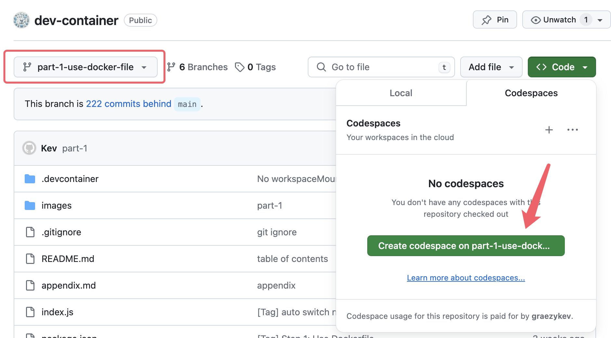
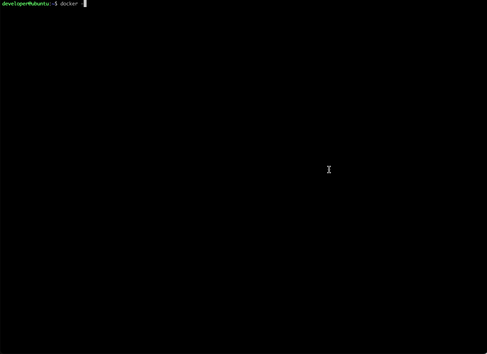
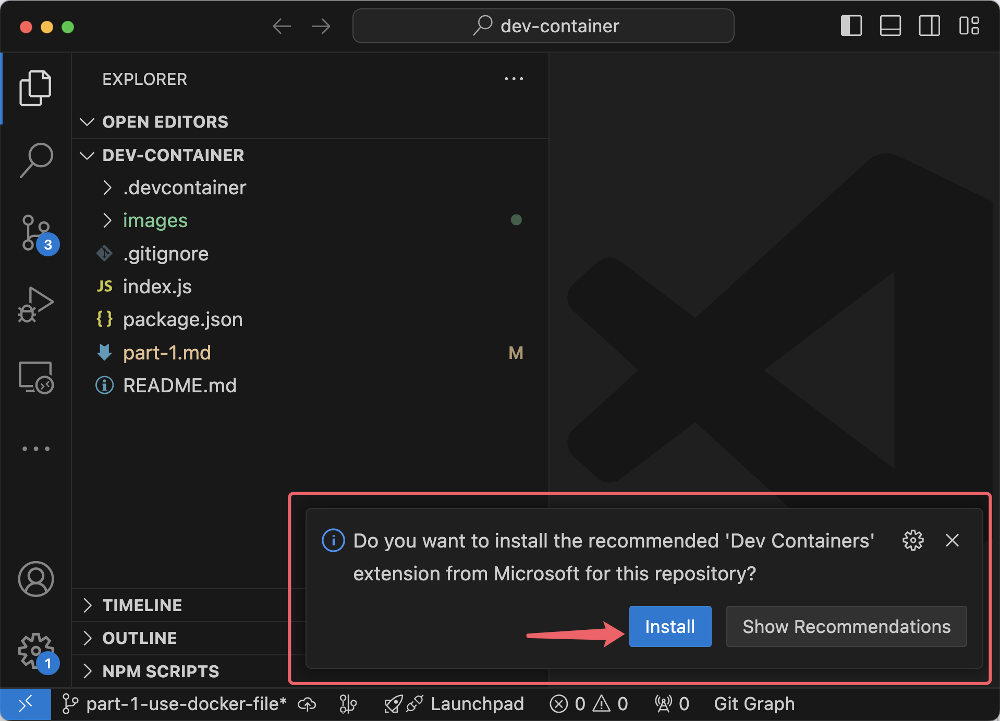
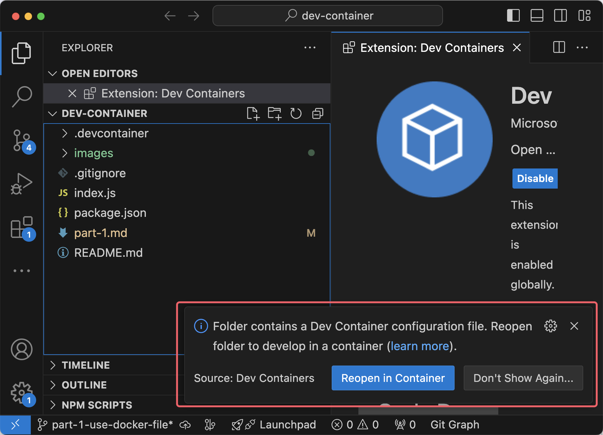
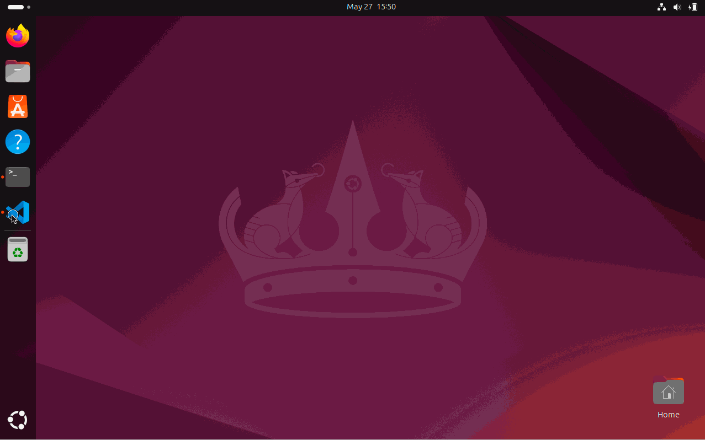
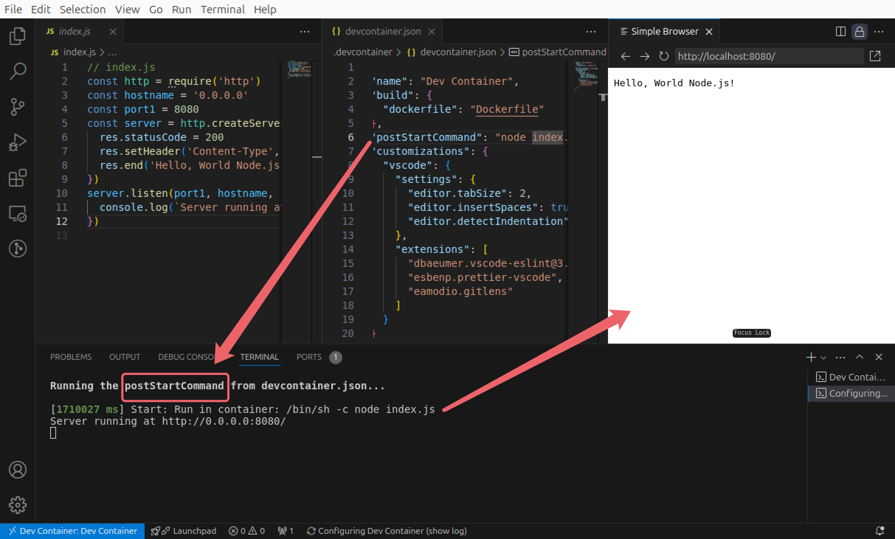
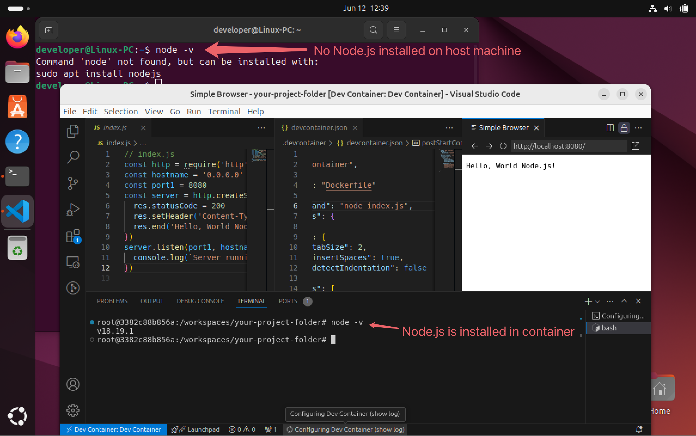
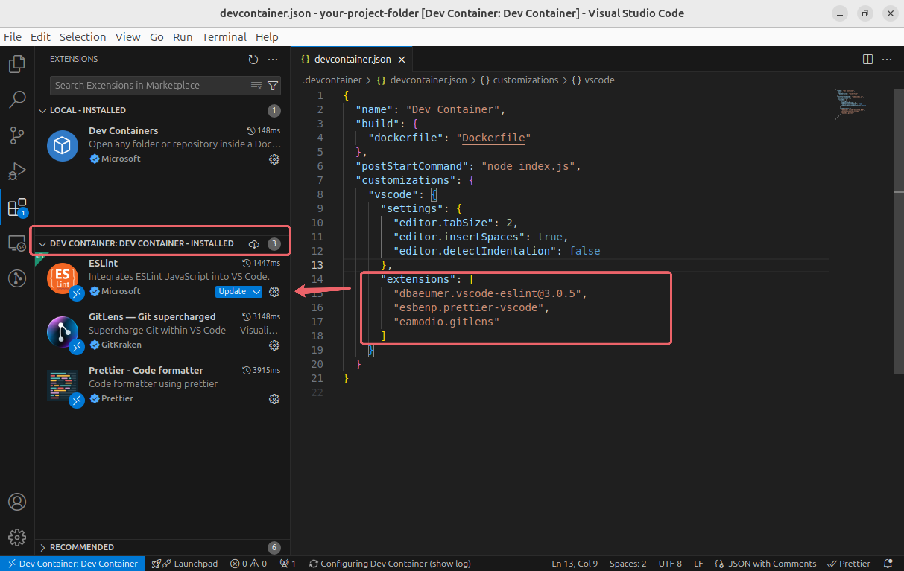

# Dev Containers - Part 1: Quick Start - Basic Setup and Usage

Welcome to the first guide in the Dev Container series:

- [Dev Containers - Why You Need Them](./README.md)
- Part 1: Quick Start - Basic Setup and Usage
- [Part 2: Image, Features, Workspace, Environment Variables](./part-2.md)
- [Part 3: Full Stack Dev - Docker Compose & Database](./part-3.md)
- [Part 4: Remote Dev - Develop on a Remote Docker Host](./part-4.md)
- [Part 5: Multiple Projects & Shared Container Configuration](./part-5.md)

To get started, you can clone [my demo project](https://github.com/graezykev/dev-container/tree/part-1-use-docker-file) using the following command:

```sh
git clone -b part-1-use-docker-file https://github.com/graezykev/dev-container.git
```

Alternatively, the faster approach is to use GitHub's Codespaces to run the demo (switch to branch `part-1-use-docker-file`):



## Introduction

In my previous post, I explained [why Dev Containers are essential](./README.md). Now, let's dive into setting up a simple Dev Container.

Imagine we have a `Node.js` project (or `Python`, `Go` etc.).

We want anyone joining our project to start developing without manually installing `Node.js`, or other required software (`YARN`, `PNPM`, etc.).

We also want to ensure they have the necessary VS Code extensions and adhere to our coding conventions, like using 2 spaces for indentation.

By defining a Dev Container, we can share all these setups seamlessly.

Future teammates will only need to build the Dev Container and start coding, without the hassle of setting up environments and installing software from scratch.

## 1. Install VS Code

First, install the VS Code client on your computer.

> Note: [JetBrains WebStorm](https://www.jetbrains.com/help/webstorm/connect-to-devcontainer.html) also supports Dev Containers, though I haven't tried it yet.

## 2. Install Docker

Installing Docker is straightforward. Follow the [official guide](https://docs.docker.com/engine/install/).

- **Windows PC**: Install **Docker Desktop** with a few clicks. [Installation guide](https://docs.docker.com/desktop/install/windows-install/).
- **Mac**: Install **Docker Desktop** with a few clicks. [Installation guide](https://docs.docker.com/desktop/install/mac-install/).
- **Linux PC**: Install **Docker Engine** with a few commands. [Installation guide](https://docs.docker.com/engine/install/ubuntu/).

For example, on Ubuntu Linux, use these commands:

```sh
# Add Docker's official GPG key:
sudo apt-get update
sudo apt-get install ca-certificates curl
sudo install -m 0755 -d /etc/apt/keyrings
sudo curl -fsSL https://download.docker.com/linux/ubuntu/gpg -o /etc/apt/keyrings/docker.asc
sudo chmod a+r /etc/apt/keyrings/docker.asc

# Add the repository to Apt sources:
echo \
  "deb [arch=$(dpkg --print-architecture) signed-by=/etc/apt/keyrings/docker.asc] https://download.docker.com/linux/ubuntu \
  $(. /etc/os-release && echo "$VERSION_CODENAME") stable" | \
  sudo tee /etc/apt/sources.list.d/docker.list > /dev/null
sudo apt-get update
```

```sh
# Install Docker Engine:
sudo apt-get install docker-ce docker-ce-cli containerd.io docker-buildx-plugin docker-compose-plugin
```

```sh
# Add user to the Docker group:
sudo usermod -aG docker $USER # replace $USER with your Linux login username
```

```sh
# Restart the system:
sudo reboot
```

```sh
# Verify the installation:
docker -v
```

Here's a recording of the installation process:



## 3. Project Setup

Clone my demo project here: <https://github.com/graezykev/dev-container/tree/part-1-use-docker-file>

```sh
git clone -b part-1-use-docker-file https://github.com/graezykev/dev-container.git
```

My demo project above might be sort of hefty and take a relatively long time to build. If you prefer a simpler demo, follow these steps to set up a "Hello World" project:

- Create a project folder and necessary files:

```sh
mkdir your-project-folder && \
cd your-project-folder && \
mkdir .devcontainer && \
touch .devcontainer/devcontainer.json && \
touch .devcontainer/Dockerfile && \
touch index.js
```

- Modify `index.js` to create a "Hello World" web page:

```js
// index.js
const http = require('http')
const hostname = '0.0.0.0'
const port1 = 8080
const server = http.createServer((req, res) => {
  res.statusCode = 200
  res.setHeader('Content-Type', 'text/plain')
  res.end('Hello, World Node.js!\n')
})
server.listen(port1, hostname, () => {
  console.log(`Server running at http://${hostname}:${port1}/`)
})
```

- Create a simple `Dockerfile`:

```dockerfile
FROM ubuntu:24.04
RUN apt-get update
RUN apt-get upgrade -y
RUN apt-get install -y nodejs
RUN apt-get install -y npm
```

- Reference the `Dockerfile` in `devcontainer.json`:

```json
{
  "name": "Dev Container",
  "build": {
    "dockerfile": "Dockerfile"
  }
}
```

This basic setup defines a Dev Container, creating a virtual Ubuntu system with `Node.js` installed.

To enhance the workflow, add an auto-run command in `devcontainer.json`:

```diff
{
  "name": "Dev Container",
  "build": {
    "dockerfile": "Dockerfile"
  },
+ "postStartCommand": "node index.js",
+ "forwardPorts": [8080]
}
```

This command will run the `Node.js` program every time the container starts.

Additionally, add configurations for VS Code extensions and editor settings:

```json
  "customizations": {
    "vscode": {
      "settings": {
        "editor.tabSize": 2,
        "editor.insertSpaces": true,
        "editor.detectIndentation": false
      },
      "extensions": [
        "dbaeumer.vscode-eslint@3.0.5",
        "esbenp.prettier-vscode",
        "eamodio.gitlens"
      ]
    }
  }
```

I specify some useful VS Code extensions here, like `ESLint`, `Prettier` and the `GitLens` visualising tools, in your scenario you may add your extensions. You can even specify the version of an extension such as `@3.0.5`.

## 4. Build Dev Container

Configuration works are done now, the next step is to build the Dev Container based on what we have configured.

### 4.1 Open Project in VS Code

In VS Code, go to `File` -> `Open Folder...` and select your project folder (`dev-container` for my demo project or `your-project-folder`).

### 4.2 Install Dev Containers Extension

VS Code will prompt you to install the Dev Containers extension (`ms-vscode-remote.remote-containers`).



Click "Install" and wait for the installation.

### 4.3 Reopen in Container

After installing the extension, VS Code will prompt you to "Reopen" your project in a container.



Click `Reopen in Container` to start the building process.

Here is a recording of the process:



### 4.4 Dev Container Built

Once you reopen the project in a container, the building process will begin. This may take some time, depending on your Dockerfile and system performance. Subsequent starts will be faster unless you change the `.devcontainer` setup.

After building, enjoy a unified development environment with all applications, extensions, and settings pre-configured!

> Moving forward, I'll refer to the computer you're using as the "**host machine**".
>
> VS Code and Docker run on the host machine, while the Dev Container is built and executed within Docker.

When the Dev Container is built or started, the `postStartCommand` specified in `devcontainer.json` will run, starting the `Node.js` server:



This `Node.js` engine runs inside the Dev Container, not on your host machine. You can verify this from the terminal:



Similarly, the VS Code extensions specified in `devcontainer.json` are installed inside the Dev Container, not on your host machine:



## Unified Working Environment

We've now created a shareable working environment with a `Node.js` engine, useful VS Code extensions, and consistent editor settings, all scoped to your project.

Next, we'll optimise this Dev Container using a reusable Docker image and add extra software without modifying the `Dockerfile`.

[Dev Containers - Part 2: Image, Features, Workspace, Environment Variables](./part-2.md)

## Appendix 1: Explanation of Basic Configurations

### Building Entry Point

The `build` -> `dockerfile` field in `devcontainer.json` serves as the entry point for the Dev Container. VS Code uses this to build and run the Docker image.

### Forwarding Ports

The `"forwardPorts": [8080]` configuration forwards ports from the container to the host machine, allowing you to access the `Node.js` server running inside the container from your host machine's browser.

`"forwardPorts": [8080]` is an abbreviation for `"forwardPorts": ["8080:8080"]`, you can make your own adjustment like `"forwardPorts": ["port-on-host:port-in-container"]`.

For more on `forwardPorts`, refer to [this guide](https://containers.dev/implementors/json_reference/#general-properties).

## Appendix 2: Lifecycle Commands Explanation

Lifecycle scripts in `devcontainer.json` run at different points in the container’s lifecycle. These can be command lines or shell scripts. For detailed information, refer to [this documentation](https://containers.dev/implementors/json_reference/#lifecycle-scripts).

- `postCreateCommand`

  - When you create a new Codespace, the postCreateCommand will run right after the container is set up.

  - When you first open a project in a VS Code dev container, the postCreateCommand will run after the container is built or rebuilt.

  If you want to install global npm packages or set environment variables, you should use this command.

- `postStartCommand`

  - You are working on a project in a Codespace. You stop the Codespace at the end of the day. The next day, you start the Codespace again to continue your work.

  - You are developing an application in a VS Code dev container. You close VS Code or restart your computer, which stops the container. Later, you reopen VS Code and the container starts again.

- `postAttachCommand`

  - You are using a Codespace for your project, and you disconnect from it (e.g., by closing the browser tab or your laptop going to sleep). Later, you reconnect to the same Codespace.

  - You are working on a project in a VS Code dev container. You close VS Code or restart your computer, then later reopen VS Code and attach to the same running container.
