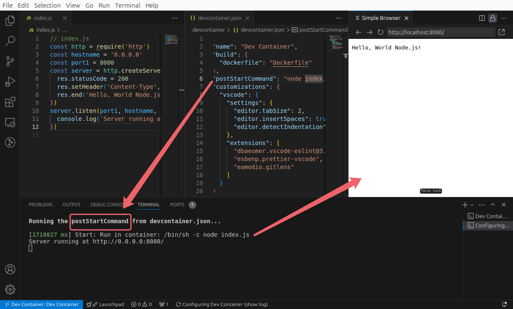
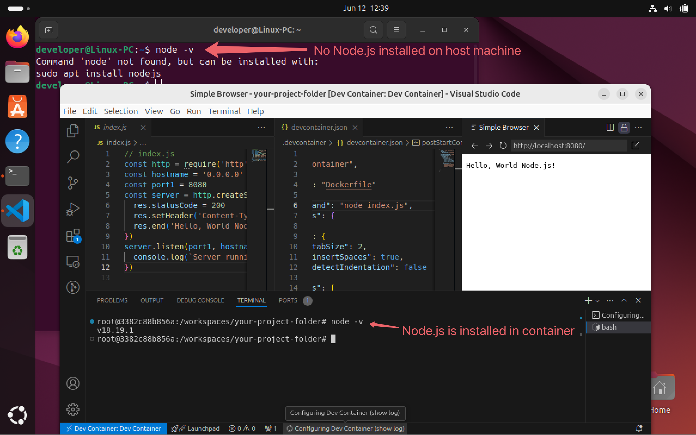
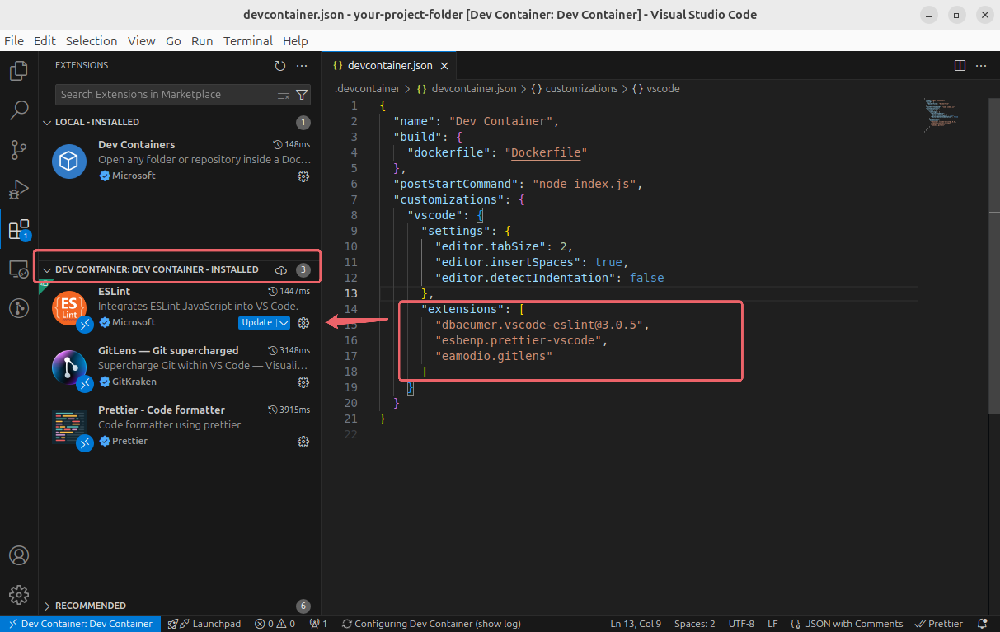

# Dev Container - Part 1: Basic Setups and Usage

I wrote about the [reason why I want to use Dev Containers](./README.md) in my last post.

Imagine we have a `Node.js` project, I want anyone who wants to develop this project (like newly joined colleagues) without manually installing `Node.js` (`Python`, `Go Lang`, or other projects are similar).

Besides, we have some "must use" VS Code extensions when they are developing this project, as it's painful for them to proofread every extension's name and install them manually, it would be great if there is a way to automatically install the extensions without noticing them!

Moreover, we have some coding conventions everyone needs to stick to, like using 2 spaces to indent our code (instead of a `Tab` or 4 spaces etc.), I want my teammates to achieve this even without knowing the conventions.

All these initial setups can be seamlessly shared by defining a Dev Container for our project and what all our future teammates need is to build this Dev Container and start developing instead of setting environments and installing software and extensions from scratch!

## 1. Install VS Code

In this guide, I primarily focus on VS Code, so first thing first, install the VS Code client on your computer.

> [JetBrains WebStorm](https://www.jetbrains.com/help/webstorm/connect-to-devcontainer.html) also supports Dev Containers, but I haven't tried it before.

## 2. Install **Docker**

Installing Docker is quite easy and fast, I suggest you follow the [official guide](https://docs.docker.com/engine/install/).

If you are using a Windows or Mac system, it's super straightforward with a few clicks to install with `.ext` or `.dmg`.

Even if you're using Linux, it's also effortless within a few Linux commands.

- Windows PC: Install **Docker Desktop** within a few clicks <https://docs.docker.com/desktop/install/windows-install/>.
- Mac: Install **Docker Desktop** within a few clicks <https://docs.docker.com/desktop/install/mac-install/>.
- Linux PC: Install **Docker Engine** within a few Linux comnands <https://docs.docker.com/engine/install/ubuntu/>.

For example, I'm using Ubuntu Linux, I install Docker Engine by the following commands according to [this guide](https://docs.docker.com/engine/install/ubuntu/), and I have a full record of the installation below.

```sh
# Add Docker's official GPG key:
sudo apt-get update
sudo apt-get install ca-certificates curl
sudo install -m 0755 -d /etc/apt/keyrings
sudo curl -fsSL https://download.docker.com/linux/ubuntu/gpg -o /etc/apt/keyrings/docker.asc
sudo chmod a+r /etc/apt/keyrings/docker.asc

# Add the repository to Apt sources:
echo \
  "deb [arch=$(dpkg --print-architecture) signed-by=/etc/apt/keyrings/docker.asc] https://download.docker.com/linux/ubuntu \
  $(. /etc/os-release && echo "$VERSION_CODENAME") stable" | \
  sudo tee /etc/apt/sources.list.d/docker.list > /dev/null
sudo apt-get update
```

```sh
sudo apt-get install docker-ce docker-ce-cli containerd.io docker-buildx-plugin docker-compose-plugin
```

```sh
sudo usermod -aG docker $USER # replace $USER with your Linux login user name
```

```sh
sudo reboot # restart the system
```

```sh
docker -v # varify the installation
```


## 3. Project Setup

If you're looking to have a glance, you can just clone my demo project here <https://github.com/graezykev/dev-container/tree/part-1-use-docker-file> and go to the next step.

```sh
git clone -b part-1-use-docker-file https://github.com/graezykev/dev-container.git part-1-use-docker-file
```

My Dev Container might be sort of hefty and take a relatively long time to build. If you prefer to write a more simple demo, here's how I set up a super simple demo:

- Initiate a project.
- Create a `.devcontainer` folder.
- Create a file named `devcontainer.json`.
- Create a file named `Dockerfile`.
- Create a simple Node.js program.

```sh
mkdir your-project-folder && \
cd your-project-folder && \
mkdir .devcontainer && \
touch .devcontainer/devcontainer.json && \
touch .devcontainer/Dockerfile && \
touch index.js
```

Let's rewrite the `Node.js` which can produce a "Hello World" web page:

```js
// index.js
const http = require('http')
const hostname = '0.0.0.0'
const port1 = 8080
const server = http.createServer((req, res) => {
  res.statusCode = 200
  res.setHeader('Content-Type', 'text/plain')
  res.end('Hello, World Node.js!\n')
})
server.listen(port1, hostname, () => {
  console.log(`Server running at http://${hostname}:${port1}/`)
})
```

If you want to start the Node.js program, you'll have to install the `Node.js` software.

This is a simple `Dockerfile` that is based on an Ubuntu Linux system, as well as `Node.js` installed:

```dockerfile
FROM ubuntu:24.04
RUN apt-get update
RUN apt-get upgrade -y
RUN apt-get install -y nodejs
RUN apt-get install -y npm
# RUN apt-get install -y python3
```

Reference `Dockerfile` in your `devcontainer.json`:

```json
{
  "name": "Dev Container",
  "build": {
    "dockerfile": "Dockerfile"
  }
}
```

This is the basic paradigm of defining a Dev Container, `devcontainer.json` is the entry point, and it uses the `Dockerfile` to build a (docker) container, kind of like creating an Ubuntu system with Node.js ready to use.

To optimise the workflow, add an auto-run command line to `devcontainer.json`:

```diff
{
  "name": "Dev Container",
  "build": {
    "dockerfile": "Dockerfile"
  },
+ "postStartCommand": "node index.js",
+ "forwardPorts": [8080]
}
```

This is intended to run the `Node.js` program every time the container is started (I'm going to elaborate more on this command `postStartCommand` later).

The configuration is yet to be finished.

Like I said from the beginning, I want to let some VS Code extensions be installed automatically, and I want my teammates to insert 2 spaces when they hit their `Tab` keys in indent the code.

Edit `devcontainer.json` to add the following configuration:

```json
  "customizations": {
    "vscode": {
      "settings": {
        "editor.tabSize": 2,
        "editor.insertSpaces": true,
        "editor.detectIndentation": false
      },
      "extensions": [
        "dbaeumer.vscode-eslint@3.0.5",
        "esbenp.prettier-vscode",
        "eamodio.gitlens"
      ]
    }
  }
```

I specify some useful VS Code extensions here, like `ESLint`, `Prettier` and `Git` visualising tools, in your scenario you may add your extensions. We can even specify the version of an extension such as `@3.0.5`.

## 4. Build Dev Container

This step is to build the Dev Container based on what we configured in the last step.

### 4.1 Open Project in VS Code

`File` -> `Open Folder...` -> Choose **your project folder** in the last step, such as `part-1-use-docker-file` in my demo project or `your-project-folder` in the demo we just created.

### 4.2 VS Code settings & extensions

VS Code will show a prompt to ask you to install the Extension of Dev Containers(`ms-vscode-remote.remote-containers`).


Click the "Install" button and wait for the installation.

### 4.3 Reopen in Container

After the extension is installed, VS Code will show another prompt to ask you to "Reopen" your project in a container, which means, to build your Dev Container.


Click `Reopen in Container`.

This is the whole process I recorded:


### 4.4 Dev Container Built

Moving forward, I'm going to call the computer we're using as a "**host machine**". VS Code client and Docker engine are installed on the host machine, while the container (Dev Container) is built and run on top of it.

After "Reopen in Container", we need to wait for the building.

Building (or rebuilding) may take some time, depending on how many tasks you define in `Dockerfile`, how fast your Internet is, and how good your computer performance is. But we only need to build for the first time we "Reopen in Container", as long as we have nothing changed in `.devcontainer` in the future, VS Code won't ask us to **rebuild**.

After the building finishes, enjoy all Applications and Extensions installed inside the container and unified Settings!

Once the Dev Container is built, or every time the container is started (such as you restart VS Code), the `postStartCommand` we specified in `devcontainer.json` with a command of `node index.js` is run, and start our `Node.js` server!



This `Node.js` engine is installed inside the the Dev Container but not on your host machine.

According to what we wrote in `Dockerfile` and `devcontainer.json`, we initiate an Ubuntu system with `Node.js` installed, we can check from the terminal console, you may not have `Node.js` installed or have a different version of it installed on your host machine:



This `Node.js` is installed inside the Dev Container, but not on your host machine, which looks like a separate "sandbox" environment for you to run  `Node.js` programs inside it.

Similarly, the VS Code extensions we specified in `devcontainer.json` are not installed on the VS Code client of your host machine, but inside the Dev Container, if you open another project in this host machine, you won't find these extensions.



## Next Step

Next, we're going to optimise this Dev Container by using a reusable docker image as an entry point, and add some extra software without using a `Dockerfile`.

[Dev Container - Part 2: Image, Features, Workspace, Environment Variables](./part-2.md)

## Appendix 1: Explanation of some Basic Configurations

### Building Entry Point

The `build` -> `dockerfile` field defined in `devcontainer.json` is the entry point of the Dev Container, VS Code automatically uses what you specify here to build a Docker image and run the image after it's built.

### Forwarding Ports

In our previous `devcontainer.json` we have a configuration `"forwardPorts": [8080]` which is used to forward ports from the container to the host machine.

As I mentioned, the `Node.js` and other environment settings are actually inside the container but do not sit on the host machine, so the `Node.js` server we started by `node index.js` is also run inside the container, if we want to visit the server from the host machine's browser (or the host machine's VS Code), we need to forward the port `8080` in the container to the host machine.

`"forwardPorts": [8080]` is an abbreviation for `"forwardPorts": ["8080:8080"]`, you can make your own adjustment like `"forwardPorts": ["port-on-host:port-in-container"]`.

Learn more about `forwardPorts` here <https://containers.dev/implementors/json_reference/#general-properties>.

## Appendix 2: Lifecycle Commands Explanation

We have used `postStartCommand` in the previous demo, here I would like to introduce more about some Lifecycle scripts you can use in `devcontainer.json`. For a full introduction, refer to this official document: <https://containers.dev/implementors/json_reference/#lifecycle-scripts>.

- `postCreateCommand`

  - When you create a new Codespace, the postCreateCommand will run right after the container is set up.

  - When you first open a project in a VS Code dev container, the postCreateCommand will run after the container is built or rebuilt.

  If you want to install global npm packages or set environment variables, you should use this command.

- `postStartCommand`

  - You are working on a project in a Codespace. You stop the Codespace at the end of the day. The next day, you start the Codespace again to continue your work.

  - You are developing an application in a VS Code dev container. You close VS Code or restart your computer, which stops the container. Later, you reopen VS Code and the container starts again.

- `postAttachCommand`

  - You are using a Codespace for your project, and you disconnect from it (e.g., by closing the browser tab or your laptop going to sleep). Later, you reconnect to the same Codespace.

  - You are working on a project in a VS Code dev container. You close VS Code or restart your computer, then later reopen VS Code and attach to the same running container.
