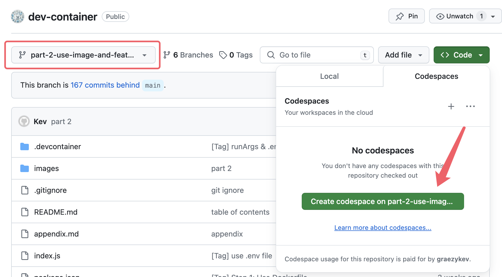
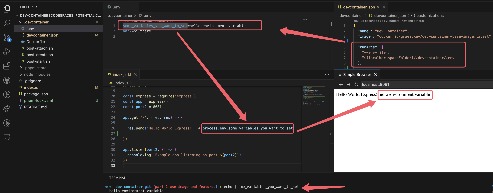

# Dev Containers - Part 2: Image, Features, Workspace, Environment Variables

Welcome to the second guide in the Dev Container series:

- [Dev Containers - Why You Need Them](./README.md)
- [Part 1: Quick Start - Basic Setup and Usage](./part-1.md)
- Part 2: Image, Features, Workspace, Environment Variables
- [Part 3: Full Stack Dev - Docker Compose & Database](./part-3.md)
- [Part 4: Remote Dev - Develop on a Remote Docker Host](./part-4.md)
- [Part 5: Multiple Projects & Shared Container Configuration](./part-5.md)

To get started, clone [my demo project](https://github.com/graezykev/dev-container/tree/part-2-use-image-and-feature) using the following command:

```sh
git clone -b part-2-use-image-and-feature https://github.com/graezykev/dev-container.git
```

Alternatively, the faster approach is to use GitHub's Codespaces to run the demo (switch to branch `part-2-use-image-and-feature`):



## Introduction

In our [last guide](./part-1.md), we introduced the basics of using `.devcontainer`, `devcontainer.json`, and a `Dockerfile` to configure and build a Dev Container.

In this guide, we'll optimise the process by adding reusable images and extra software.

## Problem

Using a `Dockerfile` in our `.devcontainer` folder to build a Dev Container can be time-consuming, especially when pre-installing multiple software.

Newcomers might face issues due to the time taken to install software while building via a `Dockerfile`. They might also end up with different versions of the software, leading to inconsistencies.

For example, the command:

```dockerfile
RUN apt-get install -y nodejs
```

might install different versions of `Node.js` over time, leading to unexpected issues.

To address this, we can provide a fixed environment with specific software versions, like `Go lang v1.22.4`, and prevent unintended upgrades. We can pre-install multiple versions of `Node.js` in this environment, allowing new team members to switch between versions easily.

This fixed environment is known as a "Docker image" or simply "image."

Newcomers just need to "clone" (download) this image and run it, similar to starting an operating system, but much faster.

## Use an Image

To streamline the process for newcomers, we build a Docker image from a basic `Dockerfile` and push it to a "cloud warehouse" - [Docker Hub](https://hub.docker.com/).

Docker Hub serves as a free file server for our built, ready-to-use Docker images, which anyone can download and reuse.

### 1. Build & Push Image

Building and pushing a Docker image is straightforward if you have a `Dockerfile` from our [last guide](./part-1.md).

You will also need to sign up for a free account on Docker Hub.

For detailed steps, check out this [guide to register, build, and push](https://github.com/graezykev/docker-build-push-101).

In the end of this step you should get a URL of the image from Docker Hub like `docker.io/your-user-name/your-image-name`.

### 2. Configure Image

Specify this image in `devcontainer.json` and remove the `Dockerfile` reference:

```diff
- "build": {
-   "dockerfile": "Dockerfile"
- }
+ "image": "docker.io/your-user-name/your-image-name"
```

> You can check out my demo and copy the image I've built here: <https://github.com/graezykev/dev-container/blob/part-2-use-image-and-features/.devcontainer/devcontainer.json#L3>
>
> Using `"image": "your-user-name/your-image-name"` also works.

That's all! When new teammates use "Open in Container" in VS Code to open our project, the image will be automatically downloaded, cloned, and started as a Dev Container on their machines.

## Features

Using an image to create Dev Containers is much faster, especially with a hefty `Dockerfile`, as we only need to build the image once (or rebuild it if modified).

However, it's yet to be ideal, consider scenarios with multiple tech stacks:

```txt
.
├── project-go-lang
├── project-node-js-1
├── project-node-js-2
├── project-postgresql
├── project-python
└── project-rust
```

Are you going to write a `Dockerfile` to pre-install all tech stacks (`Node.js`, `Go`, `Python`, etc.) and build an enormous image to use in each project?

No! You don't do this.

Instead, pre-install and pre-configure the most commonly used software in the image.

For projects with divergent tech stacks, install extra software as needed.

Adding extra software to a Dev Container is simple by specifying them in `devcontainer.json` using the `features` field. This allows different projects to use the same image with additional specific features.

For example, add the `Python` engine to `devcontainer.json` in Project A:

```diff
  "image": "docker.io/your-user-name/your-image-name",
+ "features": {
+   "ghcr.io/devcontainers/features/python:1": {
+     "version": "latest"
+   }
+ }
```

And add the `Go` language engine to `devcontainer.json` in Project B:

```diff
  "image": "docker.io/your-user-name/your-image-name",
+ "features": {
+   "ghcr.io/devcontainers/features/go:1": {}
+ }
```

Find available Dev Container features here: <https://containers.dev/features>. You can also [create your own feature](https://github.com/devcontainers/feature-starter).

Adding features is like adding sprinkles to your ice cream!

## Workspace

In the `devcontainer.json` of [my demo](https://github.com/graezykev/dev-container/blob/part-2-use-image-and-features/.devcontainer/devcontainer.json#L13-L14), you'll see these lines:

```json
  "workspaceMount": "source=${localWorkspaceFolder},target=/workspaces/${localWorkspaceFolderBasename},type=bind,consistency=cached",
  "workspaceFolder": "/workspaces/${localWorkspaceFolderBasename}",
```

These configurations aren't necessary for most cases but are worth explaining.

Well, `workspaceMount` and `workspaceFolder` always come together, to understand them, let me explain the variables of `${localWorkspaceFolder}` and `${localWorkspaceFolderBasename}` first.

### Pre-defined Variables

`${localWorkspaceFolder}` and `${localWorkspaceFolderBasename}` are some **pre-defined** variables in `devcontainer.json`.

If you have a project `project-a` on your host machine:

```txt
.
└── path
    └── to
        ├── project-a
        │   └── .devcontainer
        │       ├── Dockerfile
        │       └── devcontainer.json
        ├── project-b
        └── project-c
```

`${localWorkspaceFolder}` represents the absolute path `/path/to/project-a`, and `${localWorkspaceFolderBasename}` represents the folder name `project-a`.

### workspaceMount & workspaceFolder

When you set:

```json
"workspaceMount": "source=/path/to/project-a,target=/workspaces/project-a, ..."
```

it means you're mounting the folder `/path/to/project-a` from the host machine to the folder `/workspaces/project-a` in the container.

**Whatever you change `/path/to/project-a` on the host machine, you're making the same change in the `/workspaces/project-a` of the container, and vice versa**.

The `workspaceFolder`:

```json
"workspaceFolder": "/workspaces/project-a"
```

sets the default source code location in VS Code within the container.

i.e., **when we connect to the container in VS Code, the default source code location will be set to `workspaceFolder`.**

And, the `postStartCommand` (we mentioned in our [last guide](./part-1.md)) is also run within `workspaceFolder`.

### When to Use

You generally don't need to set `workspaceMount` and `workspaceFolder`. However, in scenarios where `project-a` needs to reference code in `project-b` or `project-c` without modifying them, you can set:

```json
"workspaceMount": "source=/path/to,target=/workspaces, ..."
"workspaceFolder": "/workspaces/project-a"
```

This mounts all projects under `/path/to` into the container while only modifying `project-a`.

## Environment Variables

In the `devcontainer.json` of [my demo](https://github.com/graezykev/dev-container/blob/part-2-use-image-and-features/.devcontainer/devcontainer.json#L9-L12), I have:

```json
"runArgs": [
  "--env-file",
  "${localWorkspaceFolder}/.devcontainer/.env"
]
```

Environment variables in Dev Containers are useful for managing configuration settings specific to your application or development environment, such as database connection strings, API keys, or feature flags.

By using environment variables, you can securely store sensitive information without hardcoding them in your code.

Moreover, creating separate environment variable files for development, testing, and production environments are very common use case.

### How to Set Environment Variables

Create a `.env` file with **key/value** pairs (mostly handled by CI/CD systems), and reference it via `runArgs` in `devcontainer.json`:

```json
"runArgs": [
  "--env-file",
  "${localWorkspaceFolder}/.devcontainer/.env"
]
```

These variables will be injected into the container as system variables:



Once the container is built and running, the variables can be used inside the container via Linux commands, shell scripts, or in your code.

## Next

In our next guide [Full Stack Dev - Docker Compose & Database](./part-3.md), we'll use environment variables to manage database passwords and usernames, avoiding exposure in version control.
