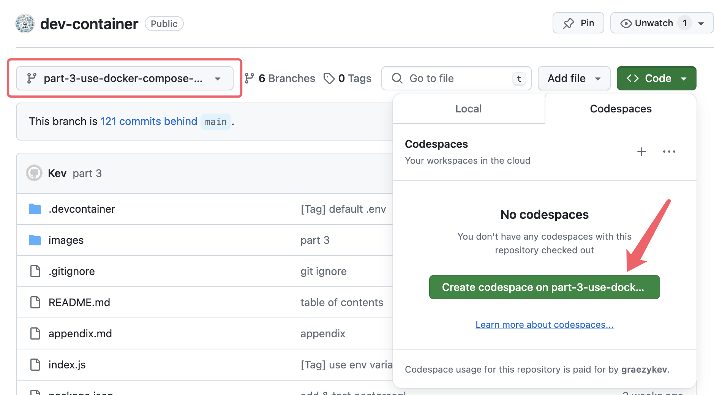
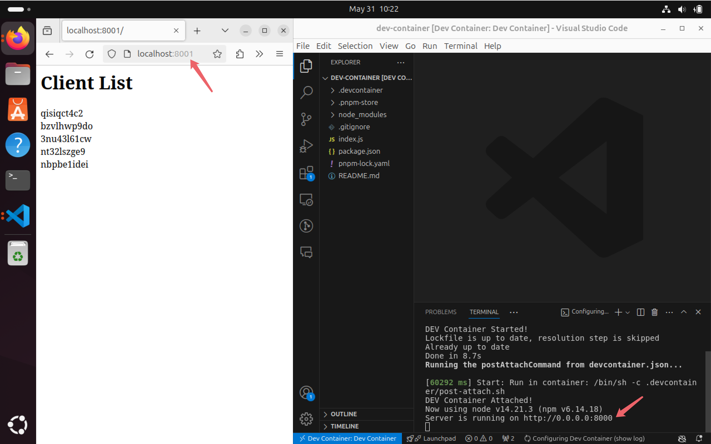
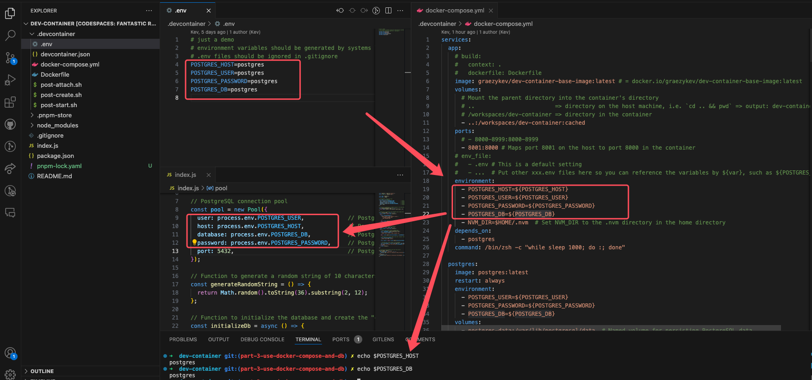
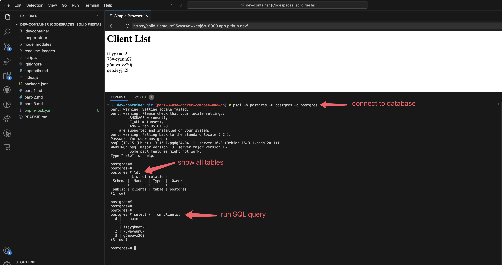

# Dev Containers - Part 3: Full Stack Dev - Docker Compose & Database

Welcome to the third guide in the Dev Container series:

- [Dev Containers - Why You Need Them](./README.md)
- [Part 1: Quick Start - Basic Setup and Usage](./part-1.md)
- [Part 2: Image, Features, Workspace, Environment Variables](./part-2.md)
- Part 3: Full Stack Dev - Docker Compose & Database
- [Part 4: Remote Dev - Develop on a Remote Docker Host](./part-4.md)
- [Part 5: Multiple Projects & Shared Container Configuration](./part-5.md)

To get started, you can clone [my demo project](https://github.com/graezykev/dev-container/tree/part-3-use-docker-compose-and-db) using the following command:

```sh
git clone -b part-3-use-docker-compose-and-db https://github.com/graezykev/dev-container.git
```

Alternatively, the faster approach is to use GitHub's Codespaces to run the demo (switch to branch `part-3-use-docker-compose-and-db`):



## Introduction

Imagine you're developing server applications relying on both `Node.js` and `PostgreSQL`. You might initially use installation commands in a `Dockerfile` (as discussed in [Part 1](./part-1.md)) or leverage Dev Container [Features](https://containers.dev/features) (covered in [Part 2](./part-2.md)) to install PostgreSQL within your container.

However, managing PostgreSQL this way can lead to unexpected behaviours if not handled correctly.

For instance, if your database startup script exits unexpectedly, the container may stop unless it includes a command to keep running, such as starting a shell or a daemon process.

## Environment Isolation

A more robust solution for development involves using [Docker Compose](https://docs.docker.com/compose/) to manage both your application container and your PostgreSQL service in **separate** containers. It's generally better to handle services like databases with separate containers or services, especially in production environments.

Using Docker Compose, you can manage two containers: one for development and the other for the database.

Install only the PostgreSQL client on your development container to connect to the PostgreSQL server running in the other container.

## I. Compose Configuration

### 0. docker-compose.yml

Creating a Docker Compose configuration file `docker-compose.yml` is crucial for using multiple containers:

```sh
touch .devcontainer/docker-compose.yml
```

```yaml
# docker-compose.yml
services:
  app:
    image: docker.io/your-user-name/your-image-name
    volumes:
      - ..:/workspaces/dev-container:cached
    ports:
      - 8001:8000
    environment:
      - POSTGRES_HOST=${POSTGRES_HOST}
      - POSTGRES_USER=${POSTGRES_USER}
      - POSTGRES_PASSWORD=${POSTGRES_PASSWORD}
      - POSTGRES_DB=${POSTGRES_DB}
    depends_on:
      - postgres

  postgres:
    image: postgres:latest
    restart: always
    environment:
      - POSTGRES_USER=${POSTGRES_USER}
      - POSTGRES_PASSWORD=${POSTGRES_PASSWORD}
      - POSTGRES_DB=${POSTGRES_DB}
    volumes:
      - postgres-data:/var/lib/postgresql/data  # Named volume for persisting PostgreSQL data
    ports:
      - 5432:5432

volumes:
  postgres-data:  # Define a named volume for PostgreSQL data persistence
```

Let's break down some basic concepts in this `docker-compose.yml`. You can also jump straight to the the next step of [Entry Point](#ii-entry-point) and come back to the explanations below.

### 1. Define `services`

We define 2 `services` here, each as a container: `app` and `postgres`.

This setup allows extending the project to include multiple other services (containers) like `app2`, `app3`, `redis`, etc.

### 2. Specify `image`

Specify the image used in `devcontainer.json` in this configuration file to initiate the `app` container.

For the database container, use the official image `postgres:latest`.

### 3. Define `volumes`

Volumes are pretty similar to the workspace mounting mentioned in [Part 2](./part-2.md#workspace).

```yaml
services:
  app:
    volumes:
      - ..:/workspaces/dev-container:cached
  postgres:
    volumes:
      - postgres-data:/var/lib/postgresql/data

volumes:
  postgres-data:  
```

If using Docker Compose, eliminate the `workspaceMount` in `devcontainer.json`:

```diff
- "workspaceMount": "source=${localWorkspaceFolder},target=/workspaces/${localWorkspaceFolderBasename},type=bind,consistency=cached",
```

For the `volumes` under container `app`, the value `..:/workspaces/dev-container` is separated by a colon `:`.

The `..` before the colon represents the path on the host machine, while `/workspaces/dev-container` after the colon represents the path in the container.

The absolute path of the Docker Compose file is `/path/to/dev-container/.devcontainer/docker-compose.yml`, so `..` equals `/path/to/dev-container/`.

This setup mounts `/path/to/dev-container/` on the host machine to `/workspaces/dev-container` in the container.

Changes in one are reflected in the other. Whatever you change `/path/to/dev-container/` on the host machine, you're making the same change in the `/workspaces/dev-container` of the container, and vice versa.

For the `volumes` under container `postgres`, the value is `postgres-data:/var/lib/postgresql/data`.

We don't have a path on the host machine to serve data for the database, so create a "virtual volume" via the configuration:

```yaml
volumes:
  postgres-data:  
```

`postgres-data` is the name used in `postgres-data:/var/lib/postgresql/data`, this volume is mounted to container `postgres`'s path `/var/lib/postgresql/data`.

Creating a virtual volume enables the persistence of database data and the ability to share it between multiple applications.

For instance, if you delete the container `postgres`, the data saved in the volume `postgres-data` still exists and is reusable when creating another database with the same volume.

### 4. Environment variables

The `docker compose` command will automatically pick up a file called `.env` in the folder containing the `docker-compose.yml`. That's why I commented out this section:

```yaml
...
    # env_file:
    #   - .env # This is a default setting
    #   - ...  # Put other xxx.env files here
...
```

Unless you use multiple `.env` files, you don't need to specify any other files here.

Also, we need to remove the `runArgs` in `devcontainer.json`:

```diff
- "runArgs": [
-   "--env-file",
-   "${localWorkspaceFolder}/.devcontainer/.env"
- ]
```

Variables in `.env` are not automatically injected into containers; pass them manually for each container:

```yaml
services:
  app:
    environment:
      - POSTGRES_HOST=${POSTGRES_HOST}
      - POSTGRES_USER=${POSTGRES_USER}
      - POSTGRES_PASSWORD=${POSTGRES_PASSWORD}
      - POSTGRES_DB=${POSTGRES_DB}
  postgres:
    environment:
      - POSTGRES_USER=${POSTGRES_USER}
      - POSTGRES_PASSWORD=${POSTGRES_PASSWORD}
      - POSTGRES_DB=${POSTGRES_DB}
```

`${POSTGRES_PASSWORD}` represents the `POSTGRES_PASSWORD` defined in `.env`, and so forth.

Pass these variables to container `postgres` to create a database with specific credentials, and to container `app` to connect to the database in container `postgres`.

> Note: In real scenarios, `.env` and database credentials should be handled by CI/CD systems.

### 5. Map `ports`

We learned "Forwarding Ports" in [Part 1](./part-1.md#forwarding-ports) but this is a bit different.

The `ports` section in `docker-compose.yml` exposes container ports to the host machine, specified as `HOST:CONTAINER`.

While the `forwardPorts` section in `devcontainer.json` is specific to VS Code Dev Containers and makes ports accessible within the container and to linked services.

In scenarios with multiple containers (`app`, `app1`, `app2`), each listening on port `8080`, map the ports as follows:

```yaml
services:
  app:
    ports:
      - 8001:8080
  app1:
    ports:
      - 8002:8080
  app2:
    ports:
      - 8003:8080
```

This setup allows using port `8001` on the host to access container `app`'s port `8080`, port `8002` for container `app1`, and so on.



## II. Entry Point

Update `devcontainer.json` to use Docker Compose as the entry point:

```diff
  "name": "Dev Container",
- "image": "docker.io/your-user-name/your-image-name"
+ "dockerComposeFile": [
+   "docker-compose.yml"
+ ],
+ "service": "app",
```

The `app` points to the service defined in `docker-compose.yml`. The `depends_on` in `docker-compose.yml` ensures `postgres` starts with `app`.

## III. Full-Stack Development

With everything prepared, build the Dev Containers (use VS Code's "Open in Container") and start full-stack development.

In my demo, I have a `Node.js` server ([index.js](https://github.com/graezykev/dev-container/blob/part-3-use-docker-compose-and-db/index.js)). You can copy `index.js` and `package.json` to your project for the demo.

This program runs in container `app`, connects to the database in container `postgres` with credentials from `.env`, creates a table named `clients` (on first run), writes new data, and displays all data on the web page.




## VI. Add Database Client (optional)

To use the `psql` command line in container `app` to connect to the PostgreSQL server in container `postgres`, install the PostgreSQL client via Dev Container Features in `devcontainer.json`:

```json
  "features": {
    "ghcr.io/robbert229/devcontainer-features/postgresql-client:1": {}
  }
```

Then, in container `app`'s terminal, connect to the database:

```sh
psql -h postgres -U postgres -d postgres
# or
# psql -h $POSTGRES_HOST -U $POSTGRES_USER -d $POSTGRES_DB
```



## Next

Our [next guide](./part-4.md) will focus on developing remotely by putting Dev Containers on a remote machine (cloud machine). This allows you to use the VS Code client or web to connect to the remote machine and Dev Containers, enabling development from anywhere.
