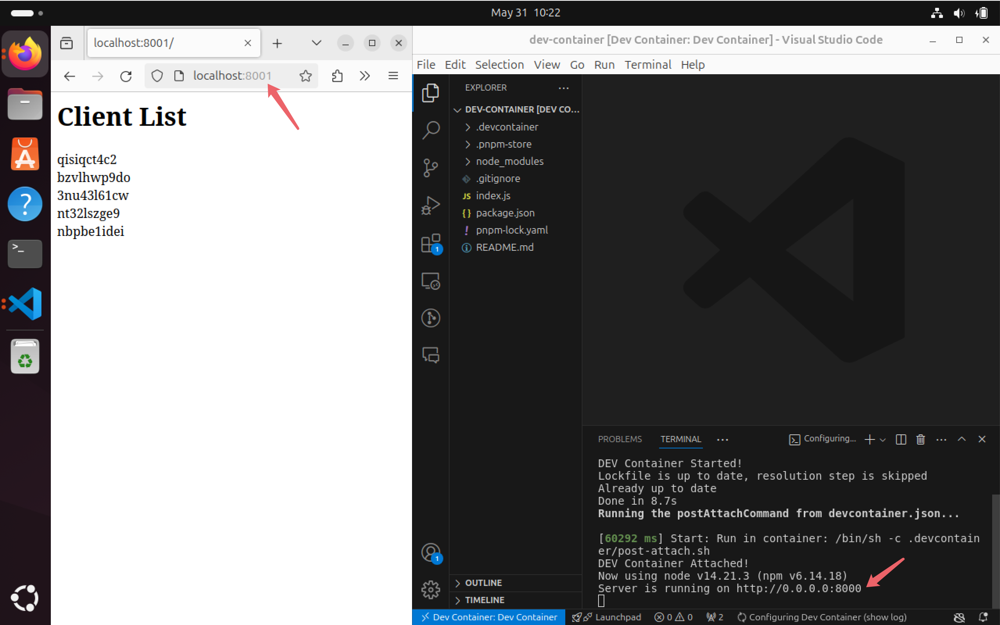
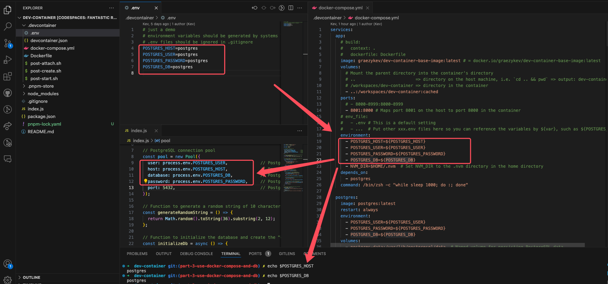

# Dev Container - Part 3: Full Stack Dev - Docker Compose & Database

This is the third guide of the Dev Container series:

- [Part 0: Dev Container - Why I Need It](./README.md)
- [Part 1: Quick Start - Basic Setups and Usage](./part-1.md)
- [Part 2: Image, Features, Workspace, Environment Variables](./part-2.md)
- Part 3: Full Stack Dev - Docker Compose & Database
- [Part 4: Remote Dev - Develop on a Remote Docker Host](./part-4.md)
- [Part 5: Multiple Projects & Shared Container Configure](./part-5.md)

> Check out my demo for this guide:
>
> ```sh
> git clone -b part-3-use-docker-compose-and-db https://github.com/graezykev/dev-container.git
> ```
>
> You can also use GitHub's Codespaces to run my demo (switch to branch `part-3-use-docker-compose-and-db`):
> 

## Introduction

Imagine you're developing server applications relying on both `Node.js` and `PostgreSQL`.

You may use installation commands in `Dockerfile` (as we mentioned in [Part 1](./part-1.md)), or, use Dev Container [Features](https://containers.dev/features)  (as we mentioned in [Part 2](./part-2.md)) to install PostgreSQL in your container. Then, have PostgreSQL start automatically when the Docker container is started.

But this can lead to unexpected behaviours if not handled correctly.

For example, if your database startup script exits for any reason, the container will stop unless it ends with an instruction to keep running, such as starting a shell or a daemon process.

## Environment Isolation

A more robust solution for development might involve using [Docker Compose](https://docs.docker.com/compose/) to manage both your application container and your PostgreSQL service in **separate** containers. It's often better to manage services like databases with separate containers or services, using Docker Compose or similar tools, especially in production environments.

That is to say, use Docker Compose to manage two containers, one for development, and the other one for database. Only install the PostgreSQL client on your development container, to connect the PostgreSQL server on the other container.

## I. Compose Configuration

### 0. docker-compose.yml

Creating a Docker Compose configuration file `docker-compose.yml` is the most important part for using multiple containers:

```sh
touch .devcontainer/docker-compose.yml
```

```yml
# docker-compose.yml
services:
  app:
    image: docker.io/your-user-name/your-image-name
    volumes:
      - ..:/workspaces/dev-container:cached
    ports:
      - 8001:8000
    # env_file:
    #   - .env # This is a default setting
    #   - ...  # Put other xxx.env files here so you can reference the variables by ${var}, such as ${POSTGRES_HOST}
    environment:
      - POSTGRES_HOST=${POSTGRES_HOST}
      - POSTGRES_USER=${POSTGRES_USER}
      - POSTGRES_PASSWORD=${POSTGRES_PASSWORD}
      - POSTGRES_DB=${POSTGRES_DB}
    depends_on:
      - postgres

  postgres:
    image: postgres:latest
    restart: always
    environment:
      - POSTGRES_USER=${POSTGRES_USER}
      - POSTGRES_PASSWORD=${POSTGRES_PASSWORD}
      - POSTGRES_DB=${POSTGRES_DB}
    volumes:
      - postgres-data:/var/lib/postgresql/data  # Named volume for persisting PostgreSQL data
    ports:
      - 5432:5432

volumes:
  postgres-data:  # Define a named volume for PostgreSQL data persistence

```

It's necessary to break down some basic concepts in this `docker-compose.yml`. But you can also jump straight to the [next step](#ii-entry-point) for now and come back later to the explanations below.

### 1. Define `services`

We define 2 `services` here, each one as a container, now we have container `app` and container `postgres`.

It also allows us to extend our project to multiple other services (containers) like `app2`, `app3`, `redis` etc.

### 2. Specify `image`

We put the image we used in `devcontainer.json` in this configuration file to initiate container `app`.

As for the container for the database, I use the official image `postgres:latest`.

### 3. Define `volumes`

Volume is pretty similar to the workspace mounting we mentioned in [Part 2](./part-2.md#workspace).

```yml
services:
  app:
    volumes:
      - ..:/workspaces/dev-container:cached
  postgres:
    volumes:
      - postgres-data:/var/lib/postgresql/data

volumes:
  postgres-data:  
```

But notice that if we're using Docker Compose we also need to eliminate the `workspaceMount` in `devcontainer.json`:

```diff
- "workspaceMount": "source=${localWorkspaceFolder},target=/workspaces/${localWorkspaceFolderBasename},type=bind,consistency=cached",
```

First, let's look at the `volumes` under container `app` whose value is `..:/workspaces/dev-container...`, which is separated by the colon `:`.

The `..` in front of the colon stands for the path on the host machine, while `/workspaces/dev-container` behind the colon stands for the path in the container.

The absolute path of the Docker Compose file is `/path/to/dev-container/.devcontainer/docker-compose.yml`, so `..` gets the value of `/path/to/dev-container/`.

That is to say, we mount `/path/to/dev-container/` on the host machine to `/workspaces/dev-container` in the container. Whatever you change `/path/to/dev-container/` on the host machine, you're making the same change in the `/workspaces/dev-container` of the container, and vice versa.

Next, look at the `volumes` under container `postgres` whose value is `postgres-data:/var/lib/postgresql/data`.

We don't have a path on the host machine to serve data for the database, so we create a "virtual volume" via the configuration:

```yml
volumes:
  postgres-data:  
```

`postgres-data` is the name, that's what we use in `postgres-data:/var/lib/postgresql/data` (also separated by the colon), this volume is mounted to container `postgres`'s path `/var/lib/postgresql/data`.

Creating a virtual volume enables the persistence of the database data and the ability to share between multiple applications.

Let's say, for some reason, you may delete the container `postgres`, but the data saved in the volume `postgres-data` still exists and is reusable when you create another database with the same volume.

### 4. Environment variables

The `docker compose` command line will automatically pick up a file called `.env` in the folder containing the `docker-compose.yml`, that's why I commented out this:

```yml
...
    # env_file:
    #   - .env # This is a default setting
    #   - ...  # Put other xxx.env files here
...
```

Unless you want to use multiple `.env` files, you don't need to specify any other files here.

So, the `runArgs` is no longer needed in `devcontainer.json`, let's get rid of it:

```diff
- "runArgs": [
-   "--env-file",
-   "${localWorkspaceFolder}/.devcontainer/.env"
- ]
```

However, variables in `.env` are not automatically injected into containers, we need to pass them for each container manually:

```yml
services:
  app:
    # ...
    environment:
      - POSTGRES_HOST=${POSTGRES_HOST}
      - POSTGRES_USER=${POSTGRES_USER}
      - POSTGRES_PASSWORD=${POSTGRES_PASSWORD}
      - POSTGRES_DB=${POSTGRES_DB}
  postgres:
    # ...
    environment:
      - POSTGRES_USER=${POSTGRES_USER}
      - POSTGRES_PASSWORD=${POSTGRES_PASSWORD}
      - POSTGRES_DB=${POSTGRES_DB}
```

The `${POSTGRES_PASSWORD}` stands for the `POSTGRES_PASSWORD` you define in `.env`, and so forth.

Here we pass these variables for container `postgres` so it can use them to create a database with the specific database name, user name and password. We also pass them to container `app` so it can use them to connect to the database in container `postgres`.

> Caveat: `.env`, database usernames, passwords etc. should handled by CI/CD systems in real scenarios.

### 5. Map `ports`

We learned "Forwarding Ports" in [Part 1](./part-1.md#forwarding-ports) but this is a bit different.

The `ports` section in a `docker-compose.yml` file allows you to expose ports from the container to the host machine.

You can specify both the host port and the container port (in the format `HOST:CONTAINER`).

The `forwardPorts` section in a `devcontainer.json` file is specific to VS Code Dev Containers.

It allows you to forward ports from inside the container to the local machine.

Unlike `ports`, which expose ports to the host machine, `forwardPorts` only makes them accessible within the container and to linked services.

In some scenarios, we may have container `app`, `app1`, and `app2` and their `Node.js` HTTP servers are listening to port `8080` respectively, in this way they are actually listening to port `8080` in their own container, from the host machine we can not use `8080` to visit all servers. So we may map the ports in this way:

```yml
services:
  app:
    ports:
      - 8001:8080 # Maps port 8001 on the host to port 8080 in the container
  app1:
    ports:
      - 8002:8080 # Maps port 8002 on the host to port 8080 in the container
  app2:
    ports:
      - 8003:8080 # Maps port 8001 on the host to port 8080 in the container
```

In this way, we can use port `8001` (on the host machine) to visit container `app`'s port `8080`, use port `8002` to visit container `app1`'s port `8080` ...



## II. Entry Point

Put our Docker Compose configuration file into `devcontainer.json` as the building entry point:

```diff
  "name": "Dev Container",
- "image": "docker.io/your-user-name/your-image-name"
+ "dockerComposeFile": [
+   "docker-compose.yml"
+ ],
+ "service": "app",
```

The `app` points to the service (container) we define in `docker-compose.yml`, and we have a `depends_on` in `docker-compose.yml` that points to container `postgres`, meaning we're going to start `postgres` at the same time with `app`.

## III. Full-Stack Development

Every preparing job has been done now let's build the Dev Containers (use VS Code's "Open in Container"), and start our full-stack development.

I have a demo `Node.js` server in [my demo](https://github.com/graezykev/dev-container/blob/part-3-use-docker-compose-and-db/index.js).

This program runs in container `app`, connects to the database (in container `postgres`) with the username and password we pass from `.env`, creates a table named `clients` (for the first time) as well as writes new data into the table every time, and show all data on the web page.




## VI. Add Database Client (optional)

Sometimes you may want to use `psql` command line in container `app` to connect to the PostgreSQL server in container `postgres`, we can install PostgreSQL client (but not server) via Dev Container Features in `devcontainer.json`:

```json
  "features": {
    "ghcr.io/robbert229/devcontainer-features/postgresql-client:1": {}
  }
```

And then inside container `app`'s terminal, we can connect to container `postgres`'s database:

```sh
psql -h postgres -U postgres -d postgres # or `psql -h $POSTGRES_HOST -U $POSTGRES_USER -d $POSTGRES_DB`
```


## Next

Our [next guide](./part-4.md) will be focusing on how to develop remotely, that is to put our Dev Containers on a remote machine (cloud machine), so we can use VS Code client or VS Code web to connect to this remote machine and Dev Containers inside it and enjoy the development anywhere.
