# Dev Containers - Part 4: Remote Dev - Develop on a Remote Docker Host

Welcome to the fourth guide in the Dev Container series:

- [Dev Containers - Why You Need Them](./README.md)
- [Part 1: Quick Start - Basic Setup and Usage](./part-1.md)
- [Part 2: Image, Features, Workspace, Environment Variables](./part-2.md)
- [Part 3: Full Stack Dev - Docker Compose & Database](./part-3.md)
- Part 4: Remote Dev - Develop on a Remote Docker Host
- [Part 5: Multiple Projects & Shared Container Configuration](./part-5.md)

To get started, you can clone [my demo project](https://github.com/graezykev/dev-container/tree/part-4-remote-dev) using the following command:

```sh
git clone -b part-4-remote-dev https://github.com/graezykev/dev-container.git
```

Alternatively, the faster approach is to use GitHub's Codespaces to run the demo (switch to branch `part-4-remote-dev`):

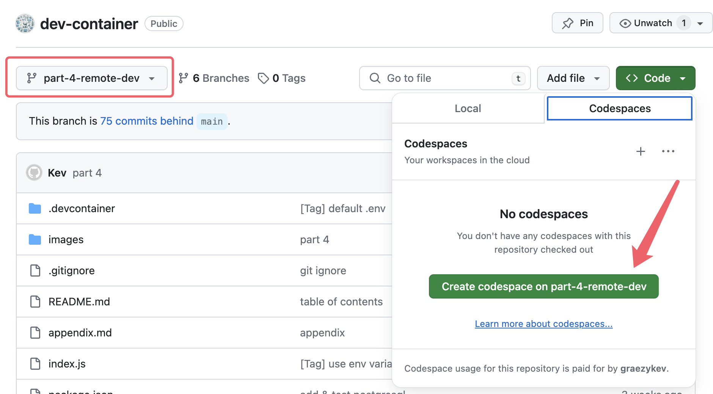

## Introduction

Here comes my favourite part: **Remote Development**, or more fashionably, cloud development.

In the previous parts, we focused on standalone PCs for building dev containers and development. In this part, I'll show you how to develop when you're not at the office or even without a working PC at your disposal.

Here's how the VS Code team explains the remote development architecture:


On the left, VS Code can be a **native client** installed on your development machine (desktop, laptop, tablet, etc.) or a **VS Code web** accessed via any web browser. This flexibility means you can work anywhere with an internet connection and a web browser.

There are two primary ways of remote development:

- **Connect to remote and virtual machines with Visual Studio Code via SSH**.
- **Connect to a remote machine via a secure tunnel, without configuring SSH**.

I'll guide you through the second method, which is simpler and avoids the lengthy, laborious tasks of installing and configuring SSH servers and clients, enabling us to work anywhere without a PC.

I won't delve into the concepts of [**Visual Studio Code Server**](https://code.visualstudio.com/docs/remote/vscode-server), although we'll be leveraging its capabilities.

## Developing with Remote Tunnels

### 0. Prepare

For remote development, you need at least two devices:

- **Remote Machine**: This serves the code and dev environment. It can be your office desktop/laptop, a Virtual Machine, or a cloud machine (e.g., AWS EC2). In this guide, I'll use an Ubuntu Linux server.
- **Dev Machine**: This can be another desktop, laptop, iPad, Surface Tablet, Android Tablet, or even a mobile phone (although using a phone is only practical for urgent scenarios).

Additionally, you'll need a **GitHub/Microsoft account**. This account acts as a bridge to connect the dev machine to the remote machine via [**Visual Studio Code Server**](https://code.visualstudio.com/docs/remote/vscode-server), ensuring secure access.

### 1. Install Docker (Remote Machine)

Install Docker on the remote machine. You don't need it on the dev machine. Instructions for installing Docker are in [Part 1](./part-1.md#2-install-docker). It's straightforward, especially on Mac/Windows PCs, and even on headless systems like an Ubuntu Linux server.

Interestingly, **you can skip installing Docker for now**, as you can install it at the end of [step 4 (Connect to Remote Machine)](#4-connect-to-remote-machine) using the terminal from the dev machine.

### 2. Install Code CLI (Remote Machine)

On the remote machine, **download and uncompress** the VS Code CLI from <https://code.visualstudio.com/download> based on your operating system.

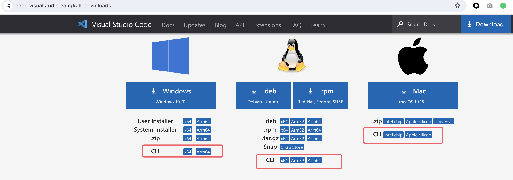

For Ubuntu Linux, use these commands (replace `cli-alpine-x64` with `cli-alpine-arm64` or `cli-linux-armhf` as needed):

```sh
curl -Lk 'https://code.visualstudio.com/sha/download?build=stable&os=cli-alpine-x64' --output vscode_cli.tar.gz && \
tar -xf vscode_cli.tar.gz
```

> You can also try my fully automatic shell script to install the CLI: <https://gist.github.com/graezykev/b7c981c4966d49e580cf1fddc0c52559>

After uncompressing, you'll find the executable binary file:

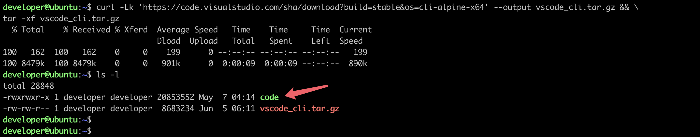

### 3. Create Secure Tunnel (Remote Machine)

Run the binary file to create a secure tunnel:

```sh
./code tunnel --accept-server-license-terms
```

Follow the steps to set up the tunnel:

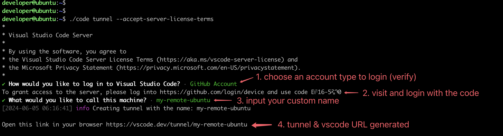

> Use the GitHub/Microsoft account mentioned earlier.

The CLI will output a **vscode.dev URL** tied to this remote machine, such as `https://vscode.dev/tunnel/<machine_name>/<folder_name>`.

### 4. Connect to Remote Machine

Now you can connect to the remote machine using the dev machine. You have two options:

1. **Directly visit the vscode.dev URL** from a web browser.

   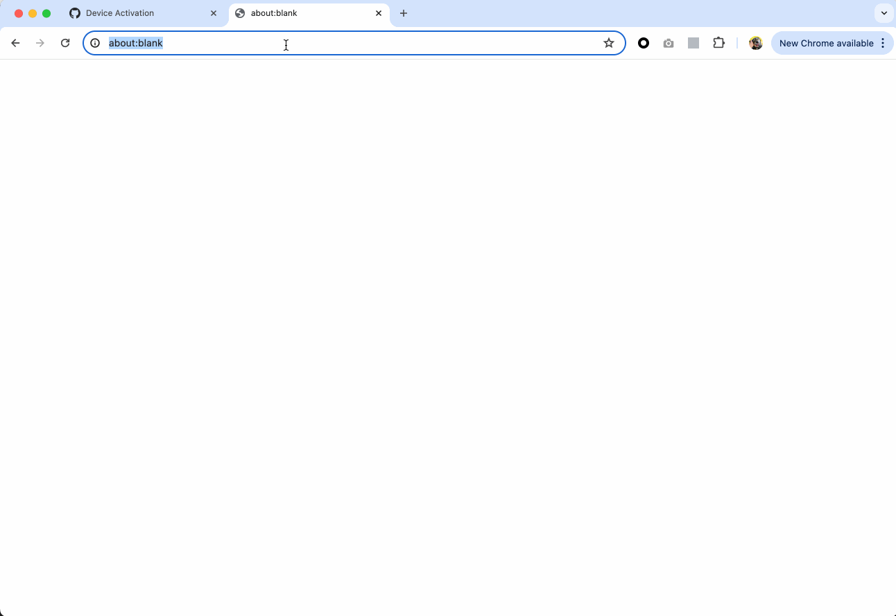

2. **Use a VS Code client**.

   1. Install the [Remote Development](https://marketplace.visualstudio.com/items?itemName=ms-vscode-remote.vscode-remote-extensionpack) extension pack (search `remote dev`).
   2. Use VS Code's `Command Palette` and choose `Connect to Tunnel`.
   3. Login and verify with the GitHub/Microsoft account you used to create the tunnel.
   4. Choose the remote machine name created in the previous step.
   5. Wait for the connection and check the status.

Here are the steps in action:

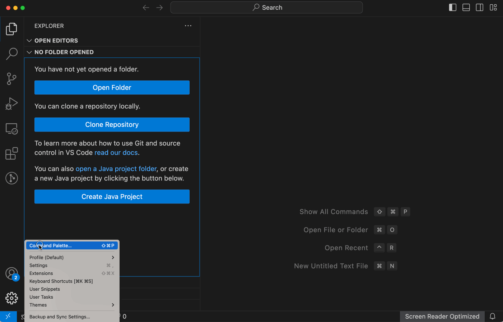

> Either option you choose, when you try to connect for the first time, you'll be prompted to log into your Github/Microsoft account at a `https://github.com/login/oauth/authorize...` URL.

Once connected, you’ll see the remote machine's name (e.g., `my-remote-ubuntu`) at the bottom left of VS Code. You now have terminal access to the remote machine.

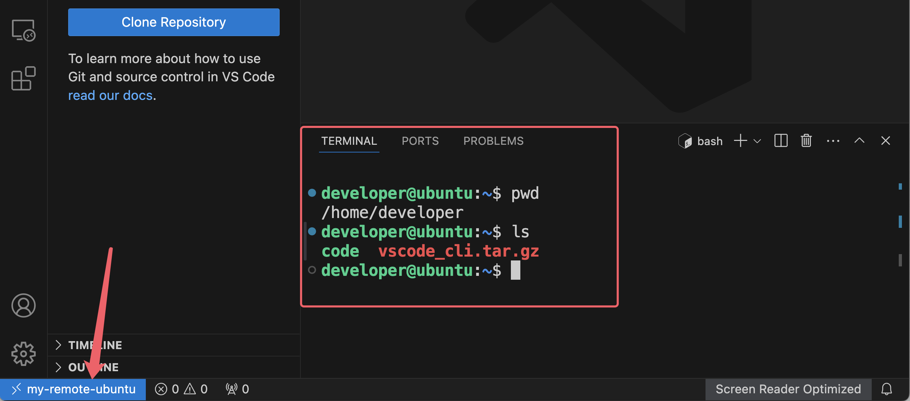

As mentioned in [step 1](#1-install-docker-remote-machine), you can install Docker from this terminal. In the example below, Docker is installed from the VS Code client's terminal following this [guide](https://docs.docker.com/engine/install/ubuntu/#installation-methods). You can even do it from VS Code web.

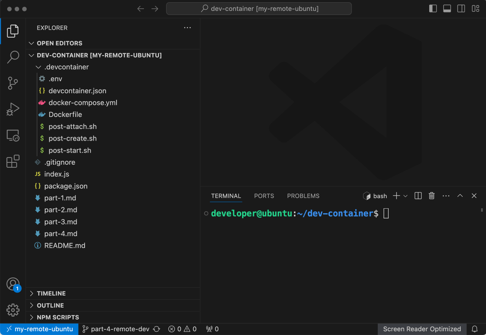

Now, we’ve established a connection to the remote machine. In the next steps, we’ll clone the code and build a dev container on it to enjoy a unified development environment.

### 5. Clone Your Project

Clone your project (which has a `.devcontainer` folder and its configurations). You can use my project for testing:

```sh
git clone -b part-4-remote-dev https://github.com/graezykev/dev-container.git
```

### 6. Build the Dev Container

> At the time of writing, building a dev container via **VS Code web** is not yet supported. You need to do this using a **native VS Code client**.

The dev container isn’t built yet, so we're still unable to use the container environment. Follow these steps:

1. Use VS Code's `Open Folder` to open the project.
2. Use VS Code's `Command Palette` and choose `Reopen in Container`.
3. Wait for the build to complete.

Here are the steps:

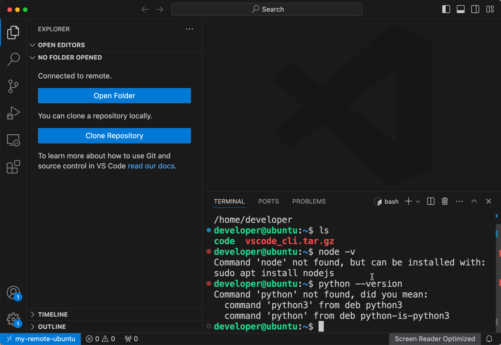

Once the container is built, enjoy the dev environment, ports mapping, VS Code extensions, settings, etc. Lifecycle commands in `devcontainer.json` will also run in the container after it’s built.

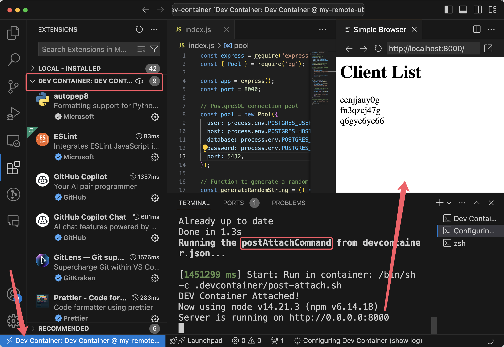

The Node.js program listens on port 8000 on the remote machine’s dev container, and the port is mapped directly to your dev machine, so you can visit it via `localhost:8000`.

Moreover, the VS Code extensions specified in `devcontainer.json` are installed on the remote machine’s dev container, not on your dev machine.

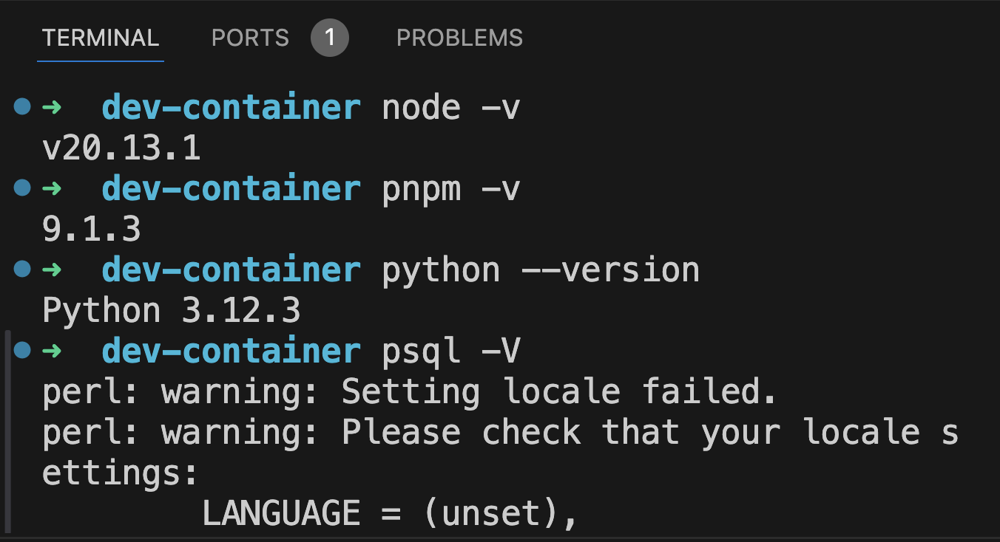

Furthermore, although the remote machine doesn’t have Node.js or Python installed, you can still enjoy the pre-installed software in the dev container built on your remote machine.

## Work Anywhere

Now you’re able to work anywhere with internet access!

Use a spare laptop (with Windows, Mac, or Linux OS) to install VS Code, login with the GitHub/Microsoft account, and connect to the remote machine via "**Remote Explorer**" (don't forget to install the [Remote Development](https://marketplace.visualstudio.com/items?itemName=ms-vscode-remote.vscode-remote-extensionpack) extension pack).

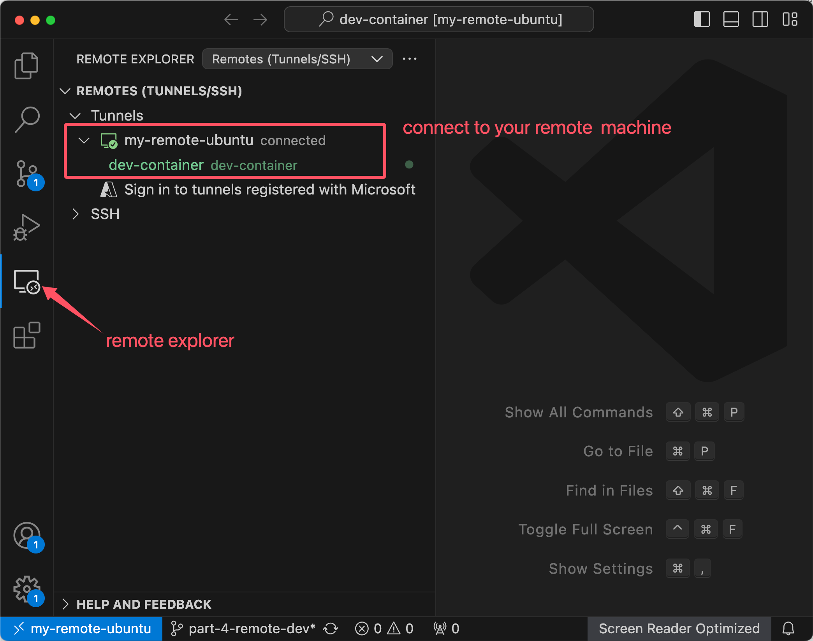

If you don’t want to install anything, use a tablet device like an iPad to visit the **vscode.dev URL** and start developing.

In urgent scenarios, you can even use a mobile phone to visit the **vscode.dev URL**, make code changes, or run commands on the remote machine.
