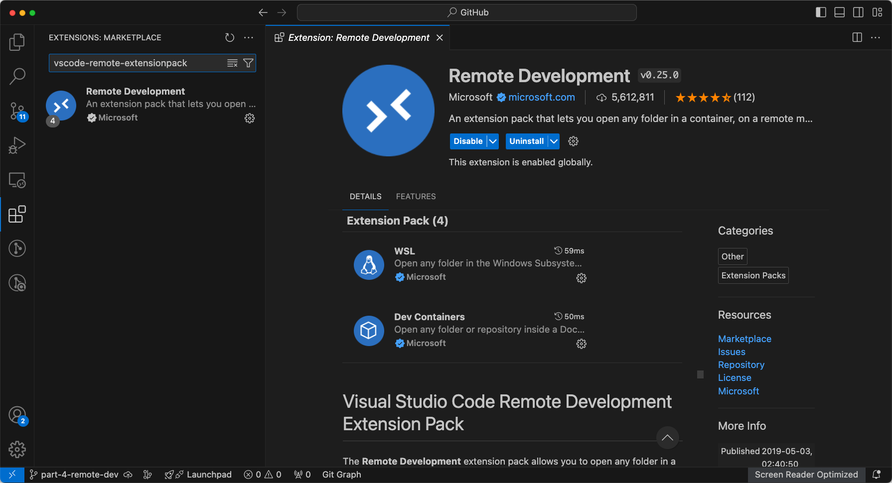
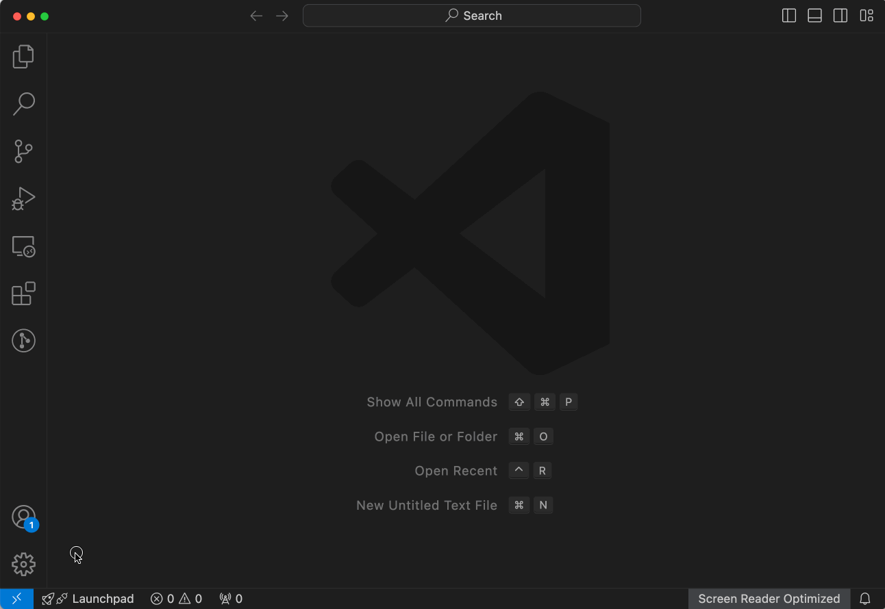
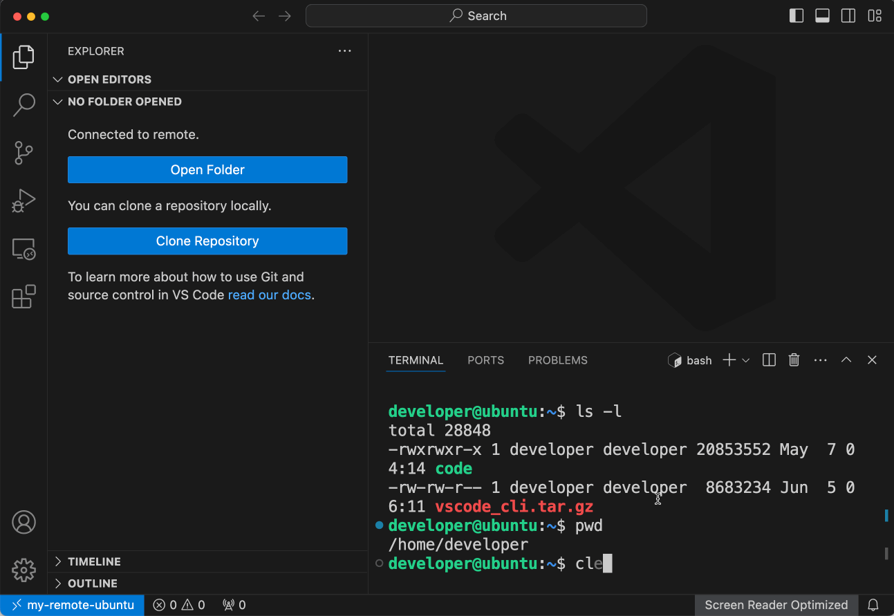
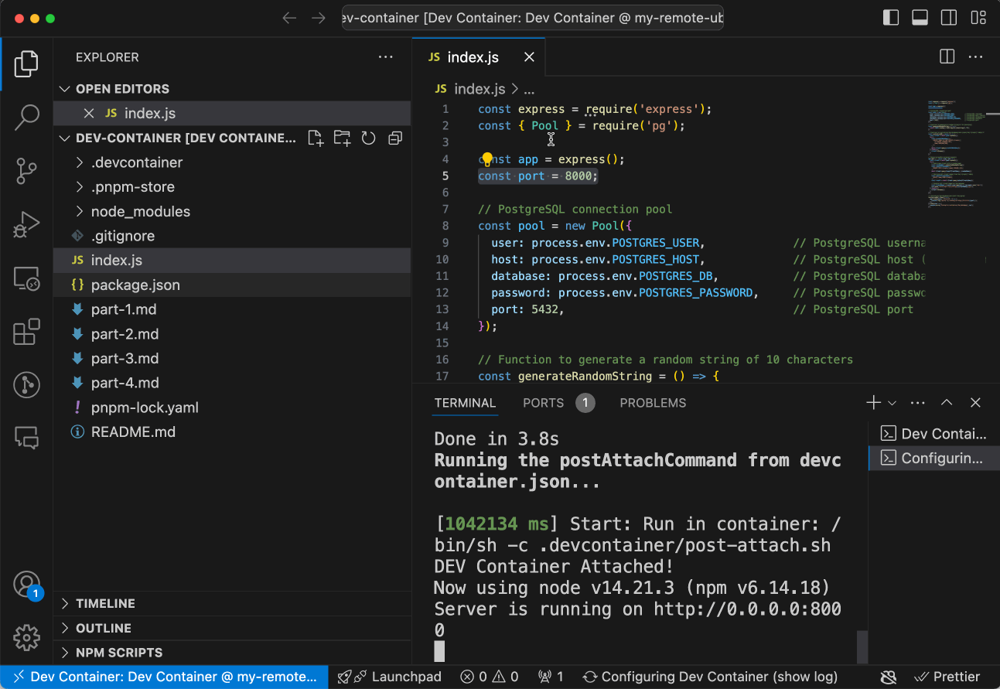

# Develop on a remote Docker host

How it works.


**VS Code** on the left can be a client installed on you development machine (a desktop, laptop, tablet etc.), or can be visit via vscode web in any web browers, this is why I say theoretically you can work everywhere as long as you have a web browser and Internet accessibility.

There're two ways of remote development:

- Connect to remote and virtual machines with Visual Studio Code via SSH.
- Connect to a remote machine via a secure tunnel, without configuring SSH.

I going to guide you through the second way, which is simpler and enables you to work anywhere without a PC. I won't elaborate the concepts of such as [**Visual Studio Code Server**](https://code.visualstudio.com/docs/remote/vscode-server) although we're leveraging the ability of them.

## Developing with Remote Tunnels

### Prepare

- A Remote Machine

Your Desktop PC / Laptop / Virtual Machine / AWS EC2 ...

- A Dev Machine

Your another Desktop PC / Laptop / iPad / Surface Tablet / Android Tablet / Mobile Phone ...

> I enlist cellphone here because in reality you can visit vscode web via a web browser, although no one really want to do that, just for some super urgent scenarios.

- A GitHub account or Microsoft account

### Install Docker

Install Docker on the remote machine.

- Linux
- Mac
- Windows

<https://docs.docker.com/engine/install/ubuntu/>

<https://docs.docker.com/engine/install/linux-postinstall/>


```console
developer@ubuntu:~$ # Add Docker's official GPG key:
sudo apt-get update
sudo apt-get install ca-certificates curl
sudo install -m 0755 -d /etc/apt/keyrings
sudo curl -fsSL https://download.docker.com/linux/ubuntu/gpg -o /etc/apt/keyrings/docker.asc
sudo chmod a+r /etc/apt/keyrings/docker.asc

# Add the repository to Apt sources:
echo \
  "deb [arch=$(dpkg --print-architecture) signed-by=/etc/apt/keyrings/docker.asc] https://download.docker.com/linux/ubuntu \
  $(. /etc/os-release && echo "$VERSION_CODENAME") stable" | \
  sudo tee /etc/apt/sources.list.d/docker.list > /dev/null
sudo apt-get update

developer@ubuntu:~$ sudo apt-get install docker-ce docker-ce-cli containerd.io docker-buildx-plugin docker-compose-plugin

developer@ubuntu:~$ sudo usermod -aG docker developer

developer@ubuntu:~$ sudo reboot

```

### Install Code CLI

Launch the remote machine and download VS Code CLI here <https://code.visualstudio.com/#alt-downloads> according to the operating system.


As I'm using Ubuntu Linux, I download and uncompress it via the following commands:

```sh
curl -Lk 'https://code.visualstudio.com/sha/download?build=stable&os=cli-alpine-x64' --output vscode_cli.tar.gz && \
tar -xf vscode_cli.tar.gz
```

After it's uncompressed you'll find the executable bin file:


### Create Secure Tunnel

```sh
./code tunnel --accept-server-license-terms
```

You'll need some step to set up the tunnel:


At last, this CLI will output a **vscode.dev URL** tied to this remote machine, like `https://vscode.dev/tunnel/<machine_name>/<folder_name>`

### Connect to the Remote Machine

Visit the **vscode.dev URL** on your Dev Machine I mentioned before, via:

- A web browser.
- A VS Code client. But install [Remote Development](https://marketplace.visualstudio.com/items?itemName=ms-vscode-remote.vscode-remote-extensionpack) extension pack first (search `vscode-remote-extensionpack`).






> When opening a vscode.dev URL for the first time, you'll be prompted to log into your GitHub account at a `https://github.com/login/oauth/authorize...` URL.

See the left bottom, and the terminal.


### Clone your Project

Clone your project to a folder.

```sh
git clone -b part-4-remote-dev https://github.com/graezykev/dev-container.git
```

Open it via `Open Folder` and `Reopen in Container` in VS Code, you'll be prompted that the remote machine needs to install Docker first.



Open VS Code's `Command Palette` and choose `Reopen in Container`.


Wait for the building.

Enjoy the dev environment, ports, extensions and settings.



### Work Everywhere

## Docs

- [Dev Containers tutorial](https://code.visualstudio.com/docs/devcontainers/tutorial)
  - How it works

- [Create a Dev Container](https://code.visualstudio.com/docs/devcontainers/create-dev-container)
  - Create a devcontainer.json file
    - Dockerfile
    - Use an image as a starting point
  - Install additional software
  - Use Docker Compose
  - [Mount & Add another local file mount](https://code.visualstudio.com/remote/advancedcontainers/add-local-file-mount)
  - [Environment variables](https://code.visualstudio.com/remote/advancedcontainers/environment-variables)

- Remote development
  - [Remote development over SSH](https://code.visualstudio.com/docs/remote/ssh-tutorial)
  - [Developing with Remote Tunnels](https://code.visualstudio.com/docs/remote/tunnels)

- [Connect to multiple containers](https://code.visualstudio.com/remote/advancedcontainers/connect-multiple-containers)
