# Develop on a remote Docker host

Here comes one of my favorite part of **Remote Development**.

In the previous parts we use a stand alone PC to build DEV containers as well as developing. In this part I would like to introduce how to develop when you're not at office or even have no working PCs at your disposal.

VS Code team actually elaborate how it works.

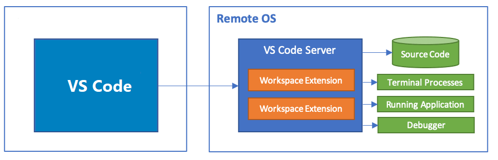

**VS Code** on the left can be a client installed on you development machine (a desktop, laptop, tablet etc.), or can be visit via vscode web in any web browers, this is why I say theoretically you can work everywhere as long as you have a web browser and Internet accessibility.

There're two ways of remote development:

- Connect to remote and virtual machines with Visual Studio Code via SSH.
- Connect to a remote machine via a secure tunnel, without configuring SSH.

I going to guide you through the second way, which is simpler and enables you to work anywhere without a PC. I won't elaborate the concepts of such as [**Visual Studio Code Server**](https://code.visualstudio.com/docs/remote/vscode-server) although we're leveraging the ability of them.

## Developing with Remote Tunnels

### Prepare

- A Remote Machine

Your Desktop PC / Laptop / Virtual Machine / AWS EC2 ...

- A Dev Machine

Your another Desktop PC / Laptop / iPad / Surface Tablet / Android Tablet / Mobile Phone ...

> I enlist cellphone here because in reality you can visit vscode web via a web browser, although no one really want to do that, just for some super urgent scenarios.

- A GitHub account or Microsoft account

### Install Docker

Install Docker on the remote machine.

- Linux
- Mac
- Windows

<https://docs.docker.com/engine/install/ubuntu/>

<https://docs.docker.com/engine/install/linux-postinstall/>

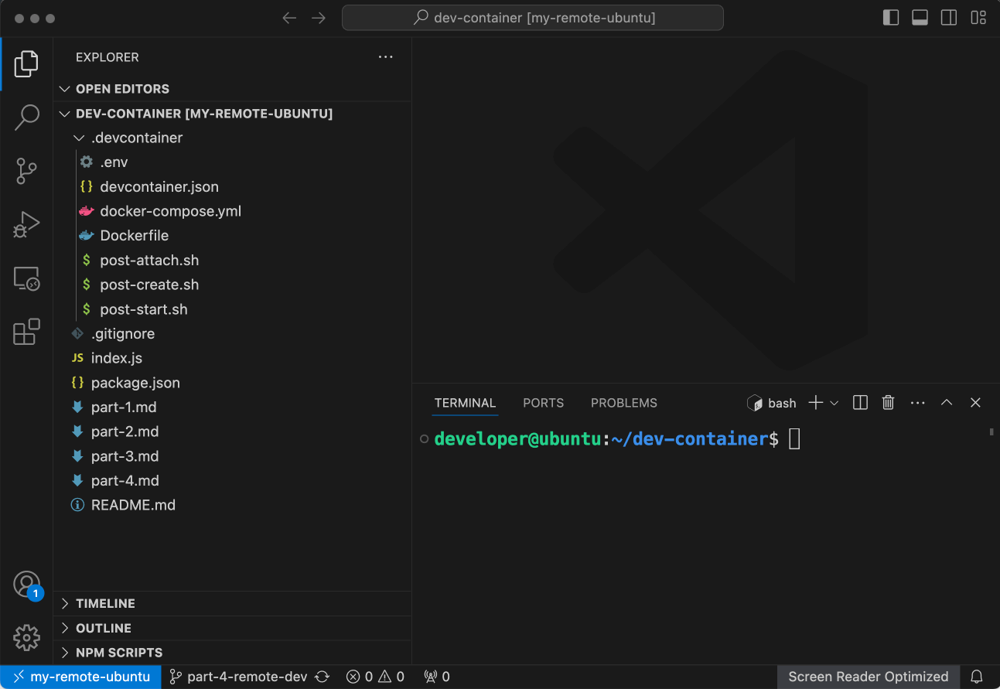

```console
developer@ubuntu:~$ # Add Docker's official GPG key:
sudo apt-get update
sudo apt-get install ca-certificates curl
sudo install -m 0755 -d /etc/apt/keyrings
sudo curl -fsSL https://download.docker.com/linux/ubuntu/gpg -o /etc/apt/keyrings/docker.asc
sudo chmod a+r /etc/apt/keyrings/docker.asc

# Add the repository to Apt sources:
echo \
  "deb [arch=$(dpkg --print-architecture) signed-by=/etc/apt/keyrings/docker.asc] https://download.docker.com/linux/ubuntu \
  $(. /etc/os-release && echo "$VERSION_CODENAME") stable" | \
  sudo tee /etc/apt/sources.list.d/docker.list > /dev/null
sudo apt-get update

developer@ubuntu:~$ sudo apt-get install docker-ce docker-ce-cli containerd.io docker-buildx-plugin docker-compose-plugin

developer@ubuntu:~$ sudo usermod -aG docker developer

developer@ubuntu:~$ sudo reboot

```

### Install Code CLI

Launch the remote machine and download VS Code CLI here <https://code.visualstudio.com/#alt-downloads> according to the operating system.

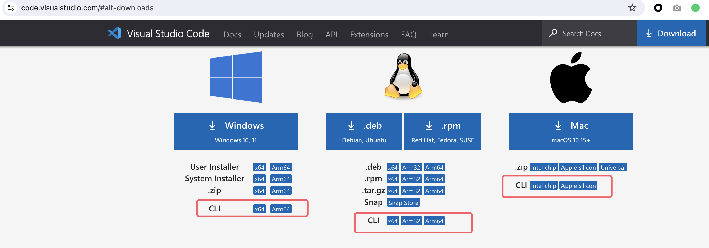

As I'm using Ubuntu Linux, I download and uncompress it via the following commands:

```sh
curl -Lk 'https://code.visualstudio.com/sha/download?build=stable&os=cli-alpine-x64' --output vscode_cli.tar.gz && \
tar -xf vscode_cli.tar.gz
```

After it's uncompressed you'll find the executable bin file:

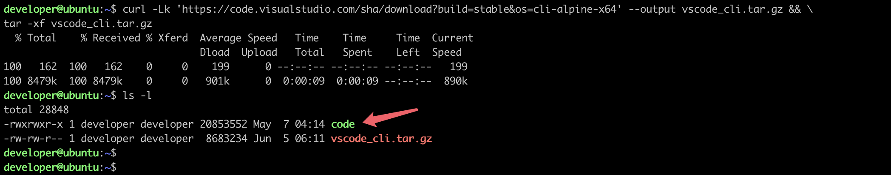

### Create Secure Tunnel

```sh
./code tunnel --accept-server-license-terms
```

You'll need some step to set up the tunnel:

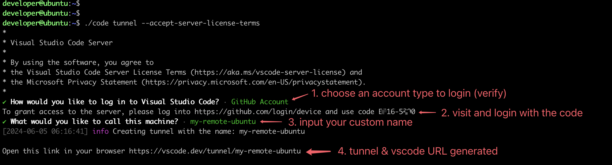

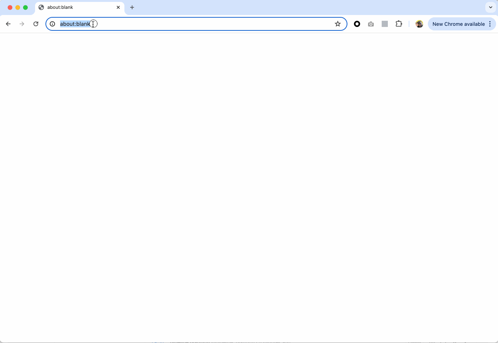
At last, this CLI will output a **vscode.dev URL** tied to this remote machine, like `https://vscode.dev/tunnel/<machine_name>/<folder_name>`

### Connect to the Remote Machine

Connecting to the Remote Machine on your Dev Machine I mentioned before, you have 2 options:

> Either way you choose, when try to connect for the first time, you'll be prompted to log into your Github/Microsoft account at a `https://github.com/login/oauth/authorize...` URL.

- Directly visit the **vscode.dev URL** in a web browser.

  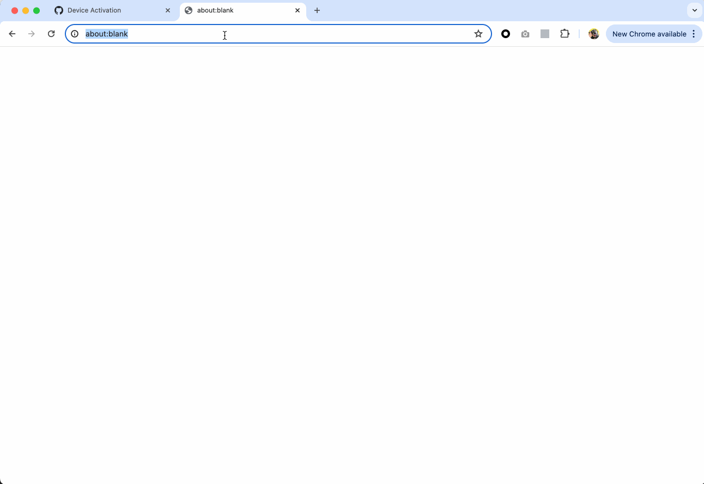

- Use a VS Code client.

  - 1. Install [Remote Development](https://marketplace.visualstudio.com/items?itemName=ms-vscode-remote.vscode-remote-extensionpack) extension pack first (search `remote dev`).
  - 2. Use VS Code's `Command Palette` and choose `Connect to Tunnel`.
  - 3. Login and verify with Github/Microsoft account (you used in the last step).
  - 4. Choose the remote machine name (you created in the last step).
  - 5. Wait for the connection and check the connection.

I recorded the steps below:

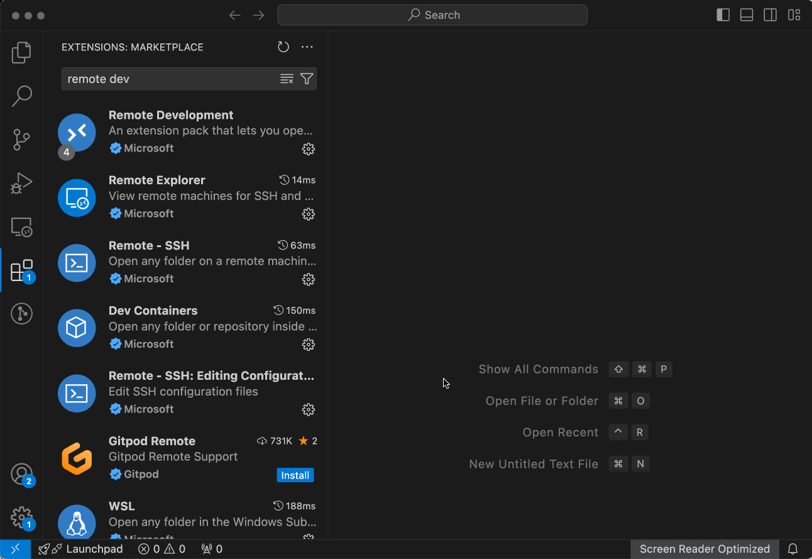

Once the remote machine is connected, on the left bottom corner of VS Code, you can see the name of the remote machine, and you have a control of it in the terminal.

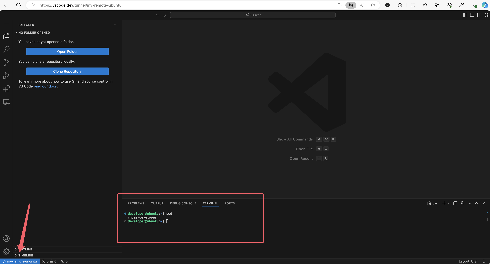

At this point, we have only connected to this remote machine, next step we're going to use this remote machine to clone codes and build Dev container on top of it so as to enjoy the truely unify dev environment.

### Clone your Project

Clone your project (which has a `.devcontainer` folder and its configurations). You can use my project for testing.

```sh
git clone -b part-4-remote-dev https://github.com/graezykev/dev-container.git
```

### Build the Dev Container

> Unfortunately, at the time I write this, we're still unable to build a Dev container via **VS Code web**, you need to make this step in a **native VS Code client**.

The container isn't built yet, we're still unable to use the container environment. We need several steps to achieve this:

- 1. Use VS Code's `Open Folder` to open the project.
- 2. Use VS Code's `Command Palette` and choose `Reopen in Container`.
- 3. Wait for the building.

I recorded the steps below:

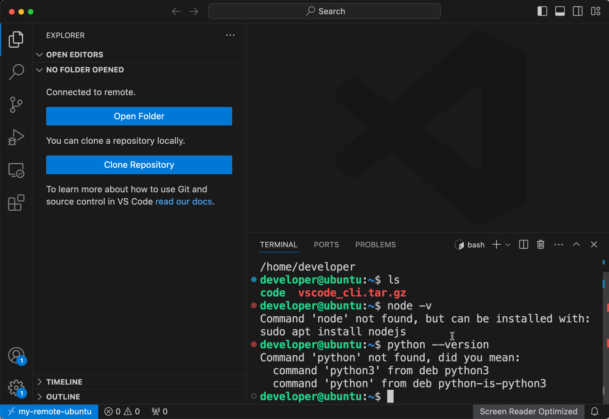

After the container is built, enjoy the dev environment, ports, extensions and settings.

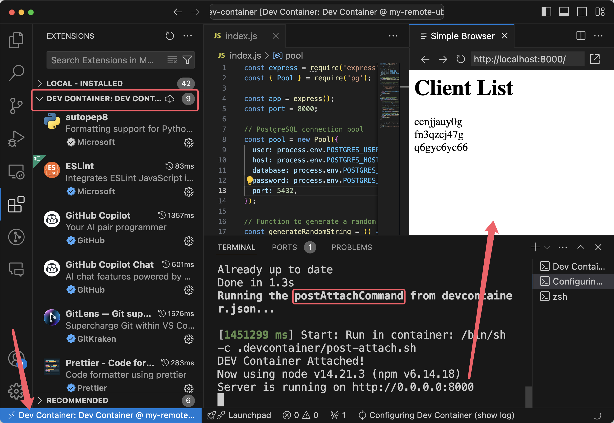

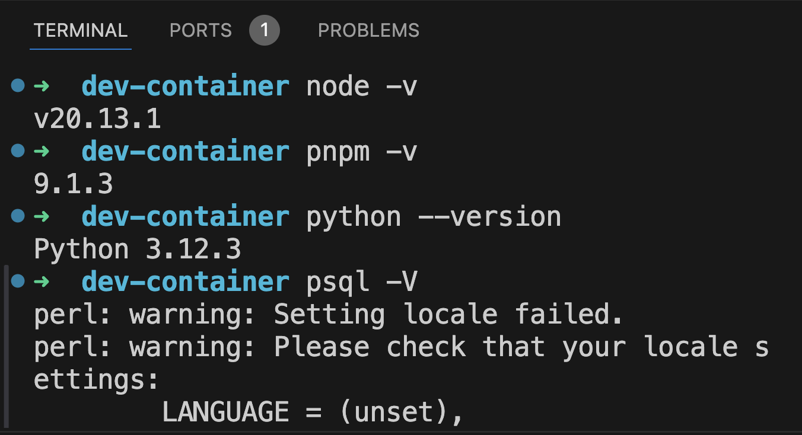

### Work Everywhere

Now you're able to work everywhere you like as long as you have access to Internet!

You can use a spare laptop (with Windows, Mac or Linux OS) to install a VS Code and connect to the remote machine.

If you don't like to install anything, why don't you just use a tablet device such as iPad to visit the **vscode.dev URL** and start your development.

In some extremly urgent cases, you can even use a mobile phone to visit the **vscode.dev URL** and make some tiny code changes or run some scripts on the remote machine!

## Docs

- [Dev Containers tutorial](https://code.visualstudio.com/docs/devcontainers/tutorial)
  - How it works

- [Create a Dev Container](https://code.visualstudio.com/docs/devcontainers/create-dev-container)
  - Create a devcontainer.json file
    - Dockerfile
    - Use an image as a starting point
  - Install additional software
  - Use Docker Compose
  - [Mount & Add another local file mount](https://code.visualstudio.com/remote/advancedcontainers/add-local-file-mount)
  - [Environment variables](https://code.visualstudio.com/remote/advancedcontainers/environment-variables)

- Remote development
  - [Remote development over SSH](https://code.visualstudio.com/docs/remote/ssh-tutorial)
  - [Developing with Remote Tunnels](https://code.visualstudio.com/docs/remote/tunnels)

- [Connect to multiple containers](https://code.visualstudio.com/remote/advancedcontainers/connect-multiple-containers)
