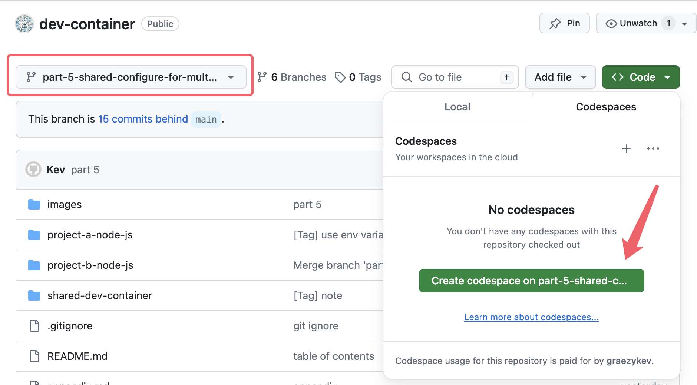
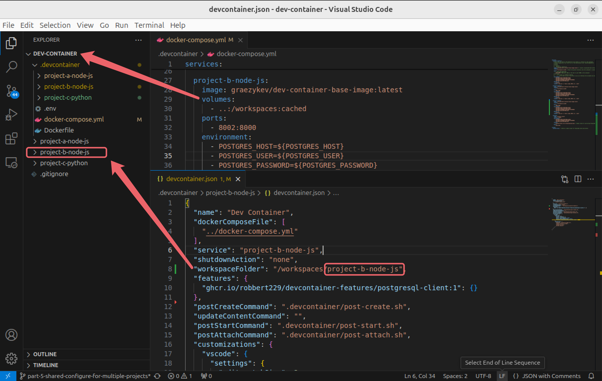
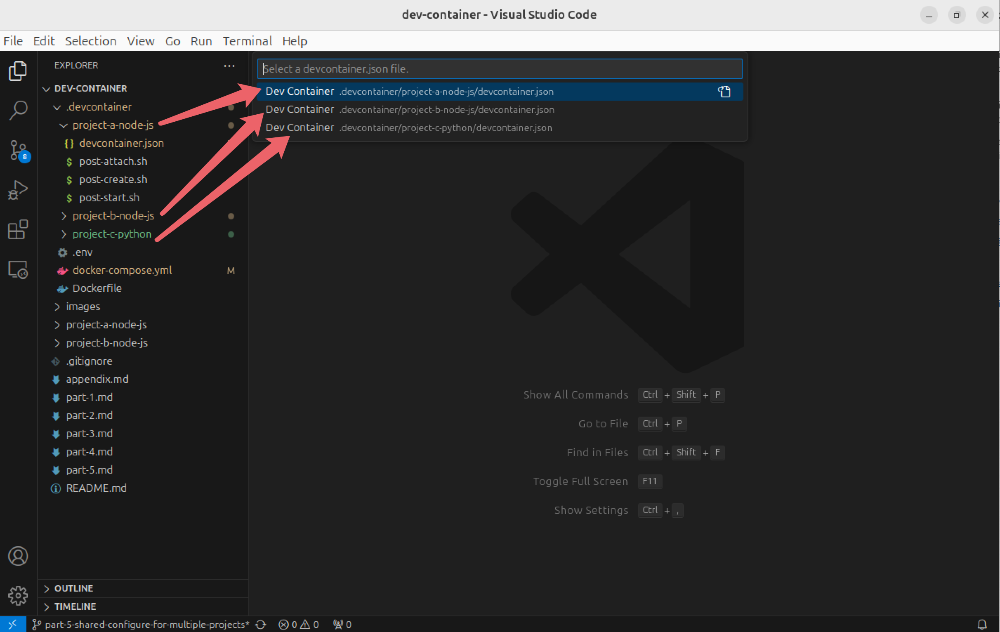

# Dev Container - Part 5: Multiple Projects & Shared Container Configure

This is the fifth guide of the Dev Container series:

- [Part 0: Dev Container - Why I Need It](./README.md)
- [Part 1: Quick Start - Basic Setups and Usage](./part-1.md)
- [Part 2: Image, Features, Workspace, Environment Variables](./part-2.md)
- [Part 3: Full Stack Dev - Docker Compose & Database](./part-3.md)
- [Part 4: Remote Dev - Develop on a Remote Docker Host](./part-4.md)
- Part 5: Multiple Projects & Shared Container Configure

I suggest you clone [my demo](https://github.com/graezykev/dev-container/tree/part-5-shared-configure-for-multiple-projects) for this guide:

```sh
git clone -b part-5-shared-configure-for-multiple-projects https://github.com/graezykev/dev-container.git
```

Alternatively, a faster approach to follow me is using GitHub's Codespaces to run my demo (switch to branch `part-5-shared-configure-for-multiple-projects`):

!

## Introduction

In [Part 3](./part-3.md) we learned about using Docker Compose in Dev Container to build containers for `Node.js` applications and databases.

Currently, you can only connect to one container per Visual Studio Code window.

Considering if you have multiple projects using different tech stacks like `Node.js`, `Python`, `Go` etc. and you need to create Dev Containers for them respectively, you have the option to put a `.devcontainer` under each of them:

```txt
.
└── path
 └── to
 ├── project-a-node-js
 │   └── .devcontainer
 │       ├── docker-compose.yml
 │       ├── ...
 │       └── devcontainer.json
 ├── project-b-node-js
 │   └── .devcontainer
 │       ├── ...
 │       └── devcontainer.json
 ├── project-c-python
 │   └── .devcontainer
 │       ├── ...
 │       └── devcontainer.json
 ├── project-d-go-lang
 │   └── .devcontainer
 │       ├── ...
 │       └── devcontainer.json
 └── project-...
```

If these applications with different tech stacks need to share the same database, you need to make sure they all use the same database container in their `docker-compose.yml` as well as the same volume:

```yml
services:

  app-name-...
    ...

  postgres:
    image: postgres:latest
    ...

...

volumes:
  postgres-data:
```

However, this can end up overlapping configurations in multiple projects which makes it tedious and difficult to maintain, I recommend a better way to share the same `docker-compose.yml`:

```txt
.
└── path
 └── to
  └── dev-container
  ├── .devcontainer
  │   ├── ...
  │   ├── .env
  │   ├── docker-compose.yml
  │   ├── ...
  │   ├── project-a-node-js
  │   │   └── devcontainer.json
  │   ├── project-b-node-js
  │   │   └── devcontainer.json
  │   ├── project-c-python
  │   │   └── devcontainer.json
  │   ├── project-d-go-lang
  │   │   └── devcontainer.json
  │   └── project-e-...
  │       └── devcontainer.json
  │
  ├── project-a-node-js
  │       └── index.js
  ├── project-b-node-js
  ├── project-c-python
  │       └── hello.py
  ├── project-d-go-lang
  └── project-e-...
```

All Projects and the `.devcontainer` folder share a common **root level** folder, and each project has an equivalent configuration folder under this common `.devcontainer`.

In this way, we define multiple Dev Containers (and container for the database) in a common `docker-compose.yml`, and create a `devcontainer.json` for each project respectively to reference the Dev Container defined in `docker-compose.yml`, so we can manage all containers in the same `docker-compose.yml`.

This also enables us to manage each project's `features` and lifecycle scripts, avoiding configuration conflicts.

Let's see how we can create this sharable Dev Container configuration.

## Common Docker Compose File

The most important thing, in the beginning, is creating a common `docker-compose.yml` inside the root level's `.devcontainer` I put in the directory tree above, and define whatever projects you like as we did in [Part 3](./part-3.md#i-compose-configuration)

```yml
services:
  project-a-node-js:
    image: graezykev/dev-container-base-image:latest
    volumes:
 - ..:/workspaces:cached
    ports:
 - 8001:8000
    depends_on:
 - postgres
    command: /bin/zsh -c "while sleep 1000; do :; done"
  
  project-b-node-js:
    ...
    volumes:
 - ..:/workspaces:cached
    ports:
 - 8002:8000
  
  project-c-python:
    ...

  project-d-go-lang:
    ...

  project-e-...

  postgres:
    ...

volumes:
  postgres-data:  
```

See the whole file in [my demo](https://github.com/graezykev/dev-container/blob/part-5-shared-configure-for-multiple-projects/.devcontainer/docker-compose.yml).

All projects share the same database in container `postgres`.

We have learned most of the concepts in [Part 3](./part-3.md#1-define-services) but there are a few things we need to pay attention to.

### Ports

Look at the ports we are mapping for each project `8001:8000`, `8002:8000`, ...

Every project is using port `8000` in its own Dev Container, and we are mapping them to port `8001`, `8002` etc. on the host machine so they can be visited via the host machine's web browser from port `8001`, `8002`, ...

This allows every project to listen to port `8000` without considering port conflicts between projects, and the host machine has specific ports to visit every project's server with different ports.

### Volumes & Workspace

Using `..:/workspaces` for the `volumes` sections is because here we want to mount this whole root level folder (`dev-container`) on the host machine to the `/workspaces` of the containers.

And in each `devcontainer.json`, we locate the specific folder in the specific project, such as `"workspaceFolder": "/workspaces/project-b-node-js"` for `project-b-node-js`, and so forth.



### Service

In each `devcontainer.json`, we need to reference the Docker Compose configurations file `docker-compose.yml` and specify the name of the `service` according to the container defined in `docker-compose.yml`.

```json
{
  "name": "Dev Container",
  "dockerComposeFile": [
    "../docker-compose.yml"
 ],
  "service": "project-a-node-js",
  "shutdownAction": "none",
  "workspaceFolder": "/workspaces/project-a-node-js"
}
```

```json
 ...
  "service": "project-b-node-js",
 ...
```

```json
 ...
  "service": "project-c-python",
 ...
```

...

The `"shutdownAction": "none"` option will leave the containers running when VS Code closes -- which prevents you from accidentally shutting down both containers by closing one window (or switching containers).

## Build and Switch Dev Containers

In VS Code, use `FILE` -> `Open Folder` to open the root level folder.

Run `Dev Containers: Reopen in Container` from the Command Palette and select the project we want to build.



This triggers building the Dev Container of the project.

Then, for other projects, we can run `Dev Containers: Switch Container` from the Command Palette and select other projects we want to build.

After each project's Dev Container is built, we can use this `Switch Container` command to switch between projects, the current VS Code window will reload and connect to the selected Dev Container.

## Extending Extending a Docker Compose File

The `dockerComposeFile` property specifies the paths to one or more Docker Compose files. When building the dev container, the `docker-compose` command runs using the **first path** specified in the array.
