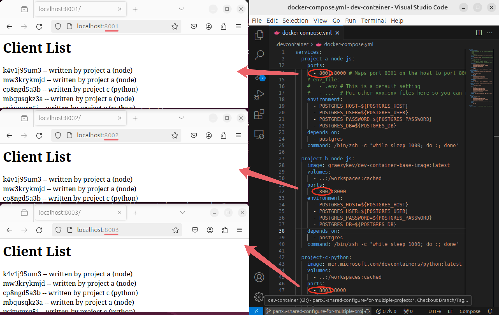

# Dev Containers - Part 5: Multiple Projects & Shared Container Configuration

Welcome to the fifth guide in the Dev Container series:

- [Dev Containers - Why You Need Them](./README.md)
- [Part 1: Quick Start - Basic Setup and Usage](./part-1.md)
- [Part 2: Image, Features, Workspace, Environment Variables](./part-2.md)
- [Part 3: Full Stack Dev - Docker Compose & Database](./part-3.md)
- [Part 4: Remote Dev - Develop on a Remote Docker Host](./part-4.md)
- Part 5: Multiple Projects & Shared Container Configuration

To get started, you can clone [my demo project](https://github.com/graezykev/dev-container/tree/part-5-shared-configure-for-multiple-projects) using the following command:

```sh
git clone -b part-5-shared-configure-for-multiple-projects https://github.com/graezykev/dev-container.git
```

Alternatively, the faster approach is to use GitHub's Codespaces to run the demo (switch to branch `part-5-shared-configure-for-multiple-projects`):

!

## Introduction

In [Part 3](./part-3.md), we learned about using Docker Compose in Dev Containers to build containers for `Node.js` applications and databases.

Currently, you can only connect to one container per Visual Studio Code window. But what if you have multiple projects using different tech stacks like `Node.js`, `Python`, `Go`, etc., and need to create Dev Containers for each?

One option is to place a `.devcontainer` folder under each project:

```plaintext
.
└── path
 └── to
    ├── project-a-node-js
    │   └── .devcontainer
    │       ├── docker-compose.yml
    │       ├── ...
    │       └── devcontainer.json
    ├── project-b-node-js
    │   └── .devcontainer
    │       ├── ...
    │       └── devcontainer.json
    ├── project-c-python
    │   └── .devcontainer
    │       ├── ...
    │       └── devcontainer.json
    ├── project-d-go-lang
    │   └── .devcontainer
    │       ├── ...
    │       └── devcontainer.json
    └── project-...
```

If these applications need to share the same database, you must ensure they all use the same database container in their `docker-compose.yml` and the same volume:

```yaml
services:

  app-name-...
    ...

  postgres:
    image: postgres:latest
    ...

...

volumes:
  postgres-data:
```

However, this can result in overlapping configurations across multiple projects, making maintenance tedious. A better approach is to share a common `docker-compose.yml`:

```plaintext
.
└── path
 └── to
  └── dev-container
      │
      ├── .devcontainer
      │   │
      │   ├── .env
      │   ├── docker-compose.yml
      │   ├── ...
      │   │
      │   ├── project-a-node-js
      │   │   └── devcontainer.json
      │   │
      │   ├── project-b-node-js
      │   │   └── devcontainer.json
      │   │
      │   ├── project-c-python
      │   │   └── devcontainer.json
      │   │
      │   ├── project-d-go-lang
      │   │   └── devcontainer.json
      │   │
      │   └── project-e-...
      │       └── devcontainer.json
      │
      ├── project-a-node-js
      │       └── index.js
      │
      ├── project-b-node-js
      │
      ├── project-c-python
      │       └── hello.py
      │
      ├── project-d-go-lang
      └── project-e-...
```

All projects and the `.devcontainer` folder share a common root-level folder, with each project having its own configuration folder under `.devcontainer`.

This setup allows you to define multiple Dev Containers (and a container for the database) in a common `docker-compose.yml`, and create a `devcontainer.json` for each project to reference the shared `docker-compose.yml`. This approach also helps manage each project's features and lifecycle scripts, avoiding configuration conflicts.

## Common Docker Compose File

First, create a common `docker-compose.yml` inside the root-level `.devcontainer`:

```yaml
services:
  project-a-node-js:
    image: graezykev/dev-container-base-image:latest
    volumes:
 - ..:/workspaces:cached
    ports:
 - 8001:8000
    depends_on:
 - postgres
    command: /bin/zsh -c "while sleep 1000; do :; done"
  
  project-b-node-js:
    ...
    volumes:
 - ..:/workspaces:cached
    ports:
 - 8002:8000
  
  project-c-python:
    ...

  project-d-go-lang:
    ...

  project-e-...

  postgres:
    ...

volumes:
  postgres-data:  
```

See the complete file in [my demo](https://github.com/graezykev/dev-container/blob/part-5-shared-configure-for-multiple-projects/.devcontainer/docker-compose.yml).

All projects share the same database container `postgres`.

We have learned most of the concepts in [Part 3](./part-3.md#1-define-services) but there are a few things we need to pay attention to.

### Ports

Notice the port mappings: `8001:8000`, `8002:8000`, etc. Each project uses port `8000` within its own Dev Container, mapped to different ports on the host machine. This setup avoids port conflicts and allows access to each project's server via distinct ports (e.g., `8001`, `8002`, etc.).

> See [demo preveiw](#demo-preview) below.

### Volumes & Workspace

Using `..:/workspaces` for the `volumes` sections mounts the entire root-level folder (`dev-container`) on the host machine to `/workspaces` in the containers.

In each `devcontainer.json`, specify the project folder within the workspace:

```json
"workspaceFolder": "/workspaces/project-b-node-js"
```


### Service

In each `devcontainer.json`, reference the Docker Compose file `docker-compose.yml` and specify the service name:

```json
{
  "name": "Dev Container",
  "dockerComposeFile": [
    "../docker-compose.yml"
  ],
  "service": "project-a-node-js",
  "shutdownAction": "none",
  "workspaceFolder": "/workspaces/project-a-node-js"
}
```

```json
{
  "service": "project-b-node-js",
  "workspaceFolder": "/workspaces/project-b-node-js"
}
```

```json
{
  "service": "project-c-python",
  "workspaceFolder": "/workspaces/project-c-python"
}
```

The `"shutdownAction": "none"` option will leave the containers running when VS Code closes -- which prevents you from accidentally shutting down both containers by closing one window (or switching containers).

## Build and Switch Dev Containers

In VS Code, open the root-level folder (`dev-container` in my demo). Run `Dev Containers: Reopen in Container` from the Command Palette and select the project to build.


This triggers the Dev Container build for the selected project.

To switch between projects, use `Dev Containers: Switch Container` from the Command Palette and select the desired project.

After each Dev Container is built, we can use this `Switch Container` command to switch between projects, the current VS Code window will reload each time and connect to the selected Dev Container.

## Demo Preview

In [my demo](https://github.com/graezykev/dev-container/tree/part-5-shared-configure-for-multiple-projects), I have three projects: two `Node.js` projects and one `Python` project, each starts an HTTP server with a web page.

When visited, the projects write "visiting records" to the shared database and display all records on the page.



